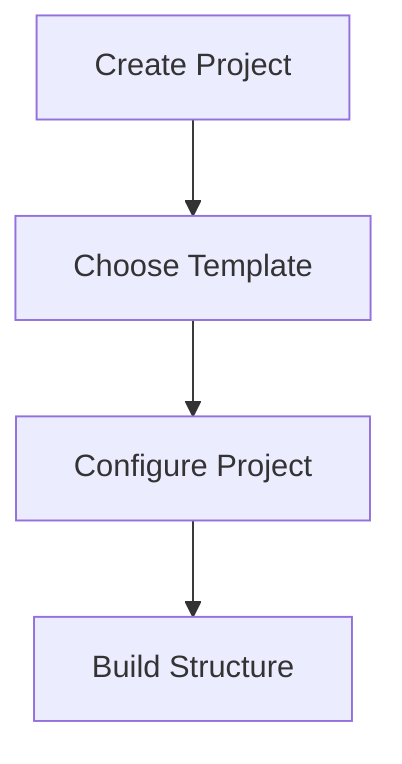
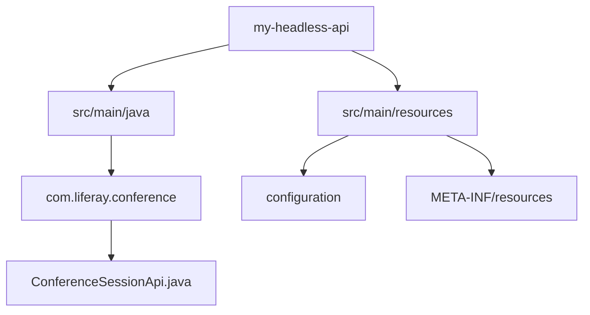
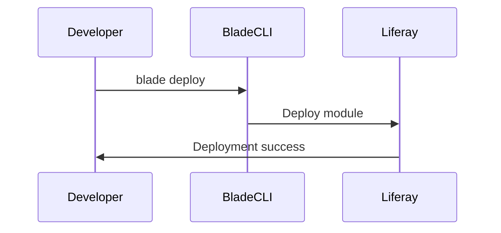
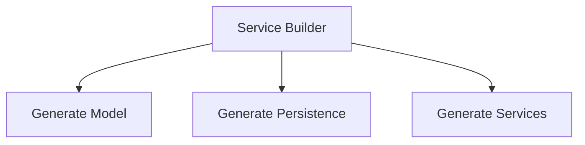
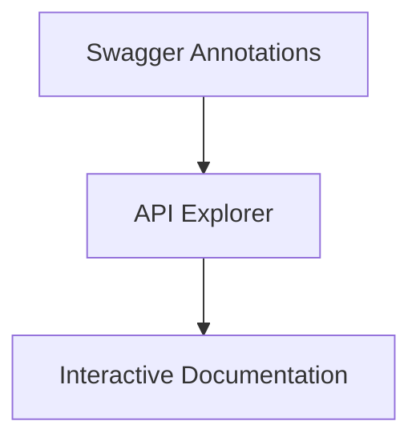
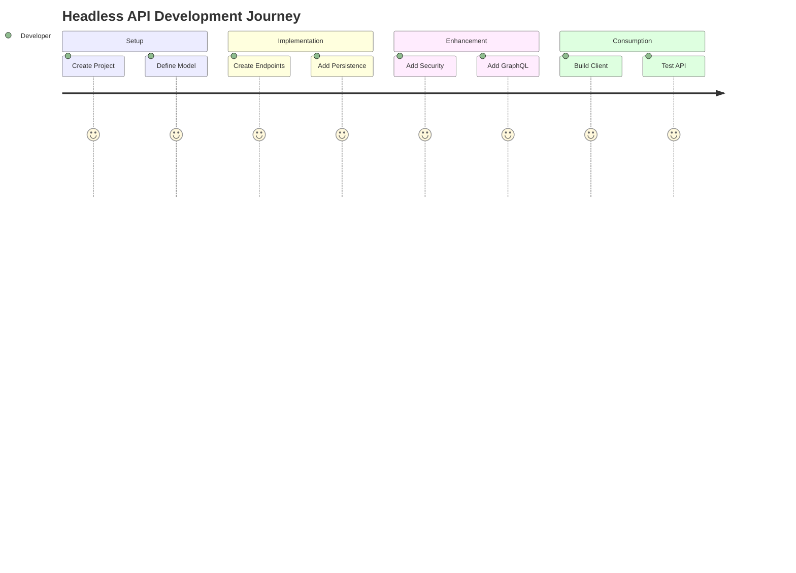

This guide will walk you through creating a complete headless solution in Liferay DXP using Blade CLI. We'll build a **Conference Session Management** system with custom headless endpoints.

## Prerequisites

- Liferay DXP 7.4+ running
- Blade CLI installed
- Java JDK 11+
- Gradle 7.x

## Step 1: Project Setup



1. Create a new Liferay workspace (if you don't have one):

```bash
blade init -v 7.4 my-headless-workspace
cd my-headless-workspace
```

2. Generate the API project:

```bash
blade create -t api -p com.liferay.conference -c ConferenceSessionApi my-headless-api
```

## Step 2: Project Structure



The generated structure will look like:

```
my-headless-api/
├── bnd.bnd
├── build.gradle
└── src
    ├── main
    │   ├── java
    │   │   └── com
    │   │       └── liferay
    │   │           └── conference
    │   │               └── ConferenceSessionApi.java
    │   └── resources
    │       ├── configuration
    │       │   └── com.liferay.portal.remote.cxf.common.configuration.CXFEndpointPublisherConfiguration-cxf.properties
    │       └── META-INF
    │           └── resources
```

## Step 3: Define the Service Interface

Edit `ConferenceSessionApi.java`:

```java
package com.liferay.conference;

import java.util.List;

import javax.ws.rs.GET;
import javax.ws.rs.Path;
import javax.ws.rs.PathParam;
import javax.ws.rs.Produces;
import javax.ws.rs.core.MediaType;

import org.osgi.service.component.annotations.Component;

@Component(
    immediate = true,
    property = {
        "jaxrs.application=true",
        "liferay.auth.verifier=false",
        "liferay.oauth2=false"
    },
    service = ConferenceSessionApi.class
)
public class ConferenceSessionApi {

    @GET
    @Path("/sessions")
    @Produces(MediaType.APPLICATION_JSON)
    public List<Session> getSessions() {
        // Implementation will go here
    }

    @GET
    @Path("/sessions/{sessionId}")
    @Produces(MediaType.APPLICATION_JSON)
    public Session getSession(@PathParam("sessionId") long sessionId) {
        // Implementation will go here
    }
}
```

## Step 4: Create Data Model

Add a new `Session.java` class:

```java
package com.liferay.conference;

public class Session {
    private long sessionId;
    private String title;
    private String description;
    private String speaker;
    private String room;
    private String timeSlot;

    // Constructors, getters and setters
    public Session() {}

    public Session(long sessionId, String title, String description,
                  String speaker, String room, String timeSlot) {
        this.sessionId = sessionId;
        this.title = title;
        this.description = description;
        this.speaker = speaker;
        this.room = room;
        this.timeSlot = timeSlot;
    }

    // Getters and setters for all fields
    // ...
}
```

## Step 5: Implement Service Methods

Update `ConferenceSessionApi.java` with implementations:

```java
// Add these methods to the ConferenceSessionApi class
private List<Session> _sessions = Arrays.asList(
    new Session(1, "Headless APIs", "Deep dive into Liferay Headless",
               "John Doe", "Room A", "10:00-11:00"),
    new Session(2, "React Integration", "Building SPAs with Liferay",
               "Jane Smith", "Room B", "11:30-12:30")
);

@GET
@Path("/sessions")
@Produces(MediaType.APPLICATION_JSON)
public List<Session> getSessions() {
    return _sessions;
}

@GET
@Path("/sessions/{sessionId}")
@Produces(MediaType.APPLICATION_JSON)
public Session getSession(@PathParam("sessionId") long sessionId) {
    return _sessions.stream()
        .filter(session -> session.getSessionId() == sessionId)
        .findFirst()
        .orElseThrow(() -> new WebApplicationException(
            "Session not found", Response.Status.NOT_FOUND));
}
```

## Step 6: Configure CXF Endpoint

Create/edit `src/main/resources/configuration/com.liferay.portal.remote.cxf.common.configuration.CXFEndpointPublisherConfiguration-cxf.properties`:

```
contextPath=/conference
```

## Step 7: Build and Deploy



Run the deployment:

```bash
blade deploy
```

## Step 8: Test the API

1. Verify the API is registered:

   - Go to `http://localhost:8080/o/api`
   - You should see your `/conference` endpoint listed

2. Test endpoints:
   - `GET http://localhost:8080/o/conference/sessions`
   - `GET http://localhost:8080/o/conference/sessions/1`

## Step 9: Add Persistence with Service Builder



1. Add Service Builder support to `build.gradle`:

```gradle
dependencies {
    compileOnly group: "com.liferay", name: "com.liferay.portal.spring.extender.api"
    compileOnly group: "com.liferay.portal", name: "com.liferay.portal.kernel"
    compileOnly group: "org.osgi", name: "org.osgi.service.component.annotations"

    // Add these for Service Builder
    compileOnly project(":modules:my-headless-api:my-headless-api-api")
    compileOnly project(":modules:my-headless-api:my-headless-api-service")
}
```

2. Create `service.xml` in `src/main/resources/META-INF`:

```xml
<?xml version="1.0"?>
<!DOCTYPE service-builder PUBLIC "-//Liferay//DTD Service Builder 7.4.0//EN" "http://www.liferay.com/dtd/liferay-service-builder_7_4_0.dtd">
<service-builder package-path="com.liferay.conference">
    <namespace>Conference</namespace>
    <entity name="Session" local-service="true" uuid="false">
        <column name="sessionId" type="long" primary="true" />
        <column name="title" type="String" />
        <column name="description" type="String" />
        <column name="speaker" type="String" />
        <column name="room" type="String" />
        <column name="timeSlot" type="String" />
    </entity>
</service-builder>
```

3. Run Service Builder:

```bash
blade gw buildService
```

## Step 10: Update API to Use Persistence

Modify `ConferenceSessionApi.java` to use the generated services:

```java
// Add these references
@Reference
private SessionLocalService _sessionLocalService;

private Session _toSession(com.liferay.conference.model.Session entity) {
    return new Session(
        entity.getSessionId(),
        entity.getTitle(),
        entity.getDescription(),
        entity.getSpeaker(),
        entity.getRoom(),
        entity.getTimeSlot());
}

@GET
@Path("/sessions")
@Produces(MediaType.APPLICATION_JSON)
public List<Session> getSessions() {
    return _sessionLocalService.getSessions(-1, -1).stream()
        .map(this::_toSession)
        .collect(Collectors.toList());
}

@GET
@Path("/sessions/{sessionId}")
@Produces(MediaType.APPLICATION_JSON)
public Session getSession(@PathParam("sessionId") long sessionId) {
    try {
        return _toSession(_sessionLocalService.getSession(sessionId));
    } catch (PortalException pe) {
        throw new WebApplicationException(
            "Session not found", Response.Status.NOT_FOUND);
    }
}
```

## Step 11: Add CRUD Operations

Extend the API with POST, PUT, DELETE:

```java
@POST
@Path("/sessions")
@Consumes(MediaType.APPLICATION_JSON)
@Produces(MediaType.APPLICATION_JSON)
public Session addSession(Session session) {
    try {
        com.liferay.conference.model.Session entity =
            _sessionLocalService.createSession(CounterLocalServiceUtil.increment());

        entity.setTitle(session.getTitle());
        entity.setDescription(session.getDescription());
        entity.setSpeaker(session.getSpeaker());
        entity.setRoom(session.getRoom());
        entity.setTimeSlot(session.getTimeSlot());

        return _toSession(_sessionLocalService.addSession(entity));
    } catch (SystemException se) {
        throw new WebApplicationException(
            "Error creating session", Response.Status.INTERNAL_SERVER_ERROR);
    }
}

@PUT
@Path("/sessions/{sessionId}")
@Consumes(MediaType.APPLICATION_JSON)
@Produces(MediaType.APPLICATION_JSON)
public Session updateSession(
    @PathParam("sessionId") long sessionId, Session session) {

    try {
        com.liferay.conference.model.Session entity =
            _sessionLocalService.getSession(sessionId);

        entity.setTitle(session.getTitle());
        entity.setDescription(session.getDescription());
        entity.setSpeaker(session.getSpeaker());
        entity.setRoom(session.getRoom());
        entity.setTimeSlot(session.getTimeSlot());

        return _toSession(_sessionLocalService.updateSession(entity));
    } catch (PortalException pe) {
        throw new WebApplicationException(
            "Session not found", Response.Status.NOT_FOUND);
    } catch (SystemException se) {
        throw new WebApplicationException(
            "Error updating session", Response.Status.INTERNAL_SERVER_ERROR);
    }
}

@DELETE
@Path("/sessions/{sessionId}")
public Response deleteSession(@PathParam("sessionId") long sessionId) {
    try {
        _sessionLocalService.deleteSession(sessionId);
        return Response.ok().build();
    } catch (PortalException pe) {
        throw new WebApplicationException(
            "Session not found", Response.Status.NOT_FOUND);
    } catch (SystemException se) {
        throw new WebApplicationException(
            "Error deleting session", Response.Status.INTERNAL_SERVER_ERROR);
    }
}
```

## Step 12: Add Swagger/OpenAPI Documentation



Add Swagger annotations to your endpoints:

```java
import io.swagger.v3.oas.annotations.Operation;
import io.swagger.v3.oas.annotations.Parameter;
import io.swagger.v3.oas.annotations.media.Content;
import io.swagger.v3.oas.annotations.media.Schema;
import io.swagger.v3.oas.annotations.responses.ApiResponse;

@Operation(
    description = "Get all conference sessions",
    responses = {
        @ApiResponse(
            content = @Content(
                mediaType = "application/json",
                schema = @Schema(implementation = Session.class)
            ),
            responseCode = "200"
        )
    }
)
@GET
@Path("/sessions")
@Produces(MediaType.APPLICATION_JSON)
public List<Session> getSessions() {
    // implementation
}
```

## Step 13: Secure the API

Update the component properties to enable security:

```java
@Component(
    immediate = true,
    property = {
        "jaxrs.application=true",
        "liferay.auth.verifier=true",
        "liferay.oauth2=true"
    },
    service = ConferenceSessionApi.class
)
```

## Step 14: Add GraphQL Support

1. Create a GraphQL servlet:

```java
@Component(
    immediate = true,
    property = {
        "osgi.http.whiteboard.context.path=/conference-graphql",
        "osgi.http.whiteboard.servlet.pattern=/conference-graphql/*"
    },
    service = Servlet.class
)
public class ConferenceGraphQLServlet extends GraphQLHttpServlet {

    @Override
    protected GraphQLSchema getSchema() {
        return GraphQLSchema.newSchema()
            .query(GraphQLObjectType.newObject()
                .name("Query")
                .field(GraphQLFieldDefinition.newFieldDefinition()
                    .name("sessions")
                    .type(new GraphQLList(SessionType))
                    .dataFetcher(env -> getSessions()))
                .build())
            .build();
    }

    // Define SessionType similarly
}
```

## Step 15: Client-Side Consumption Example

Here's a React component that consumes our API:

```javascript
import React, { useState, useEffect } from "react";
import { Liferay } from "liferay-portal";

const ConferenceSessions = () => {
  const [sessions, setSessions] = useState([]);

  useEffect(() => {
    Liferay.Util.fetch("/o/conference/sessions")
      .then((response) => response.json())
      .then((data) => setSessions(data))
      .catch((error) => console.error(error));
  }, []);

  return (
    <div className="container">
      <h2>Conference Sessions</h2>
      <ul>
        {sessions.map((session) => (
          <li key={session.sessionId}>
            <h3>{session.title}</h3>
            <p>Speaker: {session.speaker}</p>
            <p>
              Room: {session.room} at {session.timeSlot}
            </p>
          </li>
        ))}
      </ul>
    </div>
  );
};

export default ConferenceSessions;
```

## Step 16: Deployment and Testing

1. Build and deploy:

```bash
blade deploy
```

2. Verify deployment in Liferay's Gogo shell:

```bash
blade sh
lb | grep Conference
```

3. Test endpoints:

- REST: `http://localhost:8080/o/conference/sessions`
- GraphQL: `http://localhost:8080/o/conference-graphql`

## Conclusion

This tutorial demonstrated a complete headless API development lifecycle in Liferay:



You've now built a complete headless conference session management system with:

- Custom REST endpoints
- Service Builder persistence
- Swagger documentation
- GraphQL support
- Secure authentication
- Client-side consumption example

This pattern can be extended to build any headless solution in Liferay DXP.
