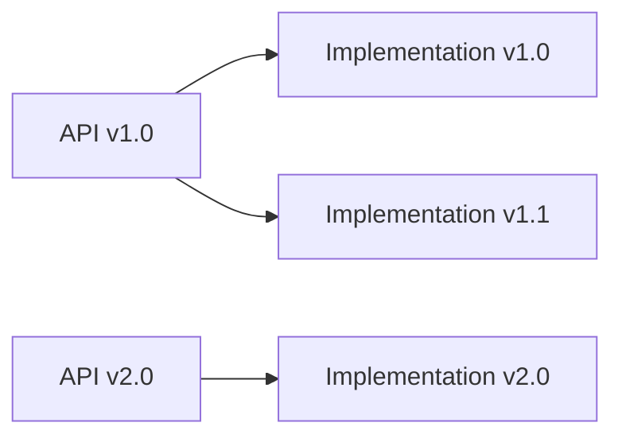

## What is an API Module in Liferay?

An API module in Liferay is an OSGi bundle (JAR file) that **exposes interfaces and contracts** for other modules to consume, without containing implementation details. It's a fundamental building block in Liferay's modular architecture.

## Key Characteristics

1. **Interface-Only Principle**:

   - Contains only Java interfaces, DTOs, exceptions, and constants
   - No concrete implementations
   - Minimal dependencies

2. **Stability Guarantees**:

   - Follows semantic versioning
   - Backward compatibility within major versions
   - Clearly marked experimental APIs

3. **OSGi Manifest**:
   - Declares exported packages
   - Specifies version ranges for imports

## Developer Use Cases

### 1. Service Contracts

```java
// my-service-api/src/main/java/com/example/BookService.java
public interface BookService {
    Book addBook(String title, String author);
    List<Book> findBooksByAuthor(String author);
}
```

**Why**:

- Defines how other modules will interact with your service
- Allows implementation to change without breaking consumers

### 2. DTO Definitions

```java
// my-service-api/src/main/java/com/example/Book.java
public class Book {
    private long bookId;
    private String title;
    private String author;
    // Getters/Setters
}
```

**Why**:

- Standardizes data transfer objects
- Enables serialization across module boundaries
- Documents expected data structure

### 3. Exception Hierarchy

```java
// my-service-api/src/main/java/com/example/exception/
public class BookValidationException extends PortalException {
    public BookValidationException(String msg) {
        super(msg);
    }
}
```

**Why**:

- Documents possible error conditions
- Allows proper error handling by consumers
- Maintains consistent error reporting

## Project Structure

Typical API module structure:

```
my-service-api/
├── src/
│   ├── main/
│   │   ├── java/
│   │   │   └── com/example/
│   │   │       ├── BookService.java
│   │   │       ├── Book.java
│   │   │       └── exception/
│   │   └── resources/
│   │       └── META-INF/
│   │           └── MANIFEST.MF
└── bnd.bnd
```

## Benefits for Developers

1. **Decoupling**:

   - Implementation can evolve independently
   - Consumers don't need recompilation when implementation changes
   - Enables multiple implementations

2. **Version Management**:

   - Clear API version boundaries
   - Supports parallel API versions during migrations
   - Semantic versioning makes breaking changes explicit

3. **Tooling Support**:

   - Javadoc becomes contract documentation
   - IDE can show only public API surface
   - Dependency analysis tools work better

4. **Testing Advantages**:
   - Mocking becomes trivial (just implement interfaces)
   - Contract tests can verify API compliance
   - Consumer tests can be written against API only

## Real-World Usage Patterns

### 1. Consumer Perspective

```java
@Component
public class MyConsumer {

    @Reference
    private BookService _bookService; // Using API interface

    public void doSomething() {
        List<Book> books = _bookService.findBooksByAuthor("Tolkien");
        // ...
    }
}
```

### 2. Provider Perspective

```java
@Component(service = BookService.class)
public class BookServiceImpl implements BookService {
    // Actual implementation
}
```

### 3. API Evolution



## Best Practices

1. **Minimal Surface Area**:

   - Expose only what's absolutely needed
   - Favor immutable DTOs
   - Avoid exposing implementation details

2. **Backward Compatibility**:

   - Use @ProviderType for interfaces meant to be implemented by others
   - Use @ConsumerType for interfaces meant to be consumed
   - Deprecate rather than remove

3. **Documentation**:

   - Comprehensive Javadoc
   - Usage examples
   - Thread safety guarantees

4. **Versioning**:
   - Follow semantic versioning strictly
   - Put experimental APIs in separate packages
   - Use package-info.java for version metadata

## Common Pitfalls to Avoid

1. **Leaking Implementation**:

   ```java
   // Bad - exposes concrete class
   public class BookService {
       public BookImpl getBook(long id);
   }
   ```

2. **Overloading DTOs**:

   ```java
   // Bad - mixing API and internal concerns
   public class Book {
       // API fields
       private String title;

       // Internal fields
       private long companyId;
   }
   ```

3. **Versioning Mistakes**:
   - Changing APIs in patch versions
   - Not properly documenting breaking changes
   - Mixing versions in same package

## When to Create an API Module

1. **Creating Reusable Services**:

   - When functionality needs multiple implementations
   - When exposing services to other teams/modules

2. **Public Extensibility Points**:

   - For plugins/extensions systems
   - When allowing custom implementations

3. **Complex Systems**:
   - Large projects with multiple teams
   - When clear interface boundaries are needed

API modules are the backbone of Liferay's modular architecture, enabling clean separation of concerns, version management, and stable extension points while maintaining flexibility in implementations.
