Liferay's Headless APIs provide a way to interact with Liferay DXP's functionality without being tied to its traditional portal interface. These RESTful APIs follow modern web standards and allow developers to build:

- Mobile applications
- Progressive Web Apps (PWAs)
- Single Page Applications (SPAs)
- Microservices architectures
- IoT integrations
- Third-party system integrations

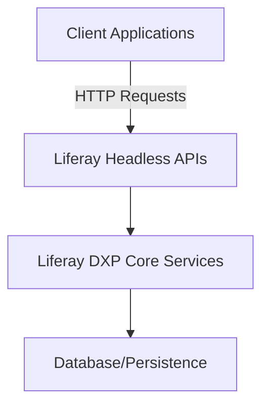

## Types of Headless Solutions in Liferay

### 1. Headless Delivery APIs

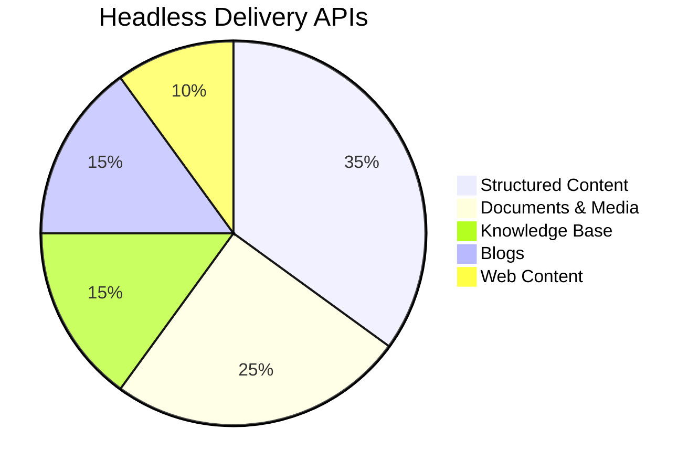

- **Web Content Management**: CRUD operations for web content articles, structures, and templates
- **Documents and Media**: Manage and retrieve documents, folders, and file entries
- **Blogs**: Create, read, update blog posts and handle comments
- **Knowledge Base**: Manage knowledge base articles and folders

### 2. Headless Admin APIs

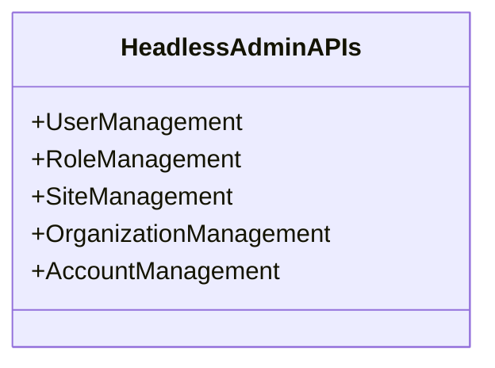

- User and role management
- Site and organization administration
- Account management for B2B scenarios
- Permission checking and assignment

### 3. Headless Commerce APIs

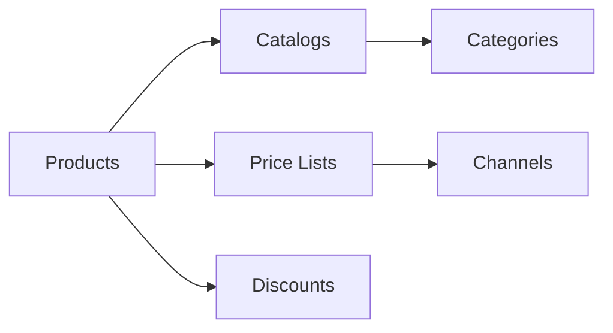

- Product management
- Catalog operations
- Price lists and discounts
- Order processing
- Inventory management

### 4. Headless Workflow APIs

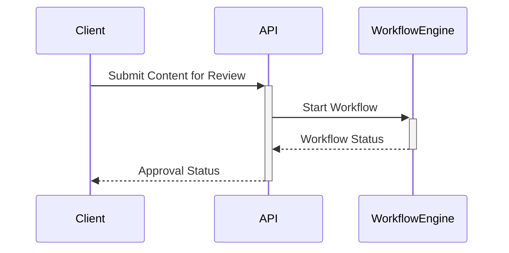

- Submit content for review
- Check workflow status
- Handle workflow tasks
- Manage workflow definitions

## Key Technical Features

### 1. RESTful Architecture

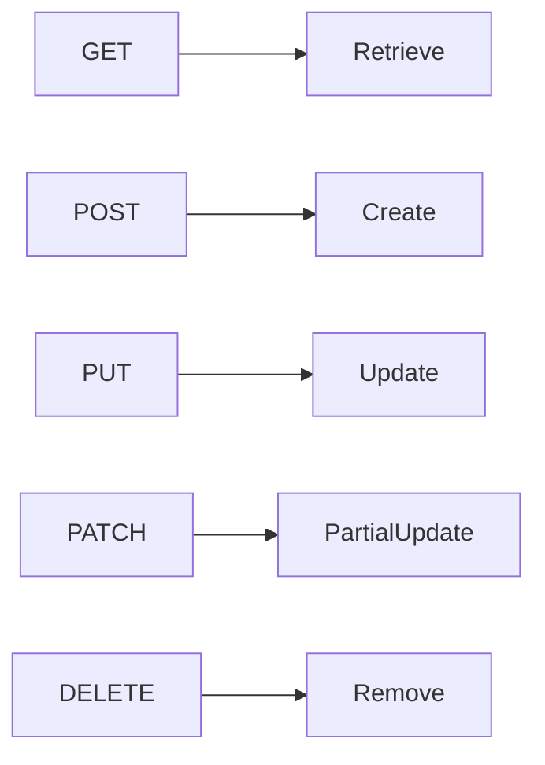

- Standard HTTP methods (GET, POST, PUT, PATCH, DELETE)
- Resource-oriented URLs
- JSON payloads by default

### 2. Authentication Options

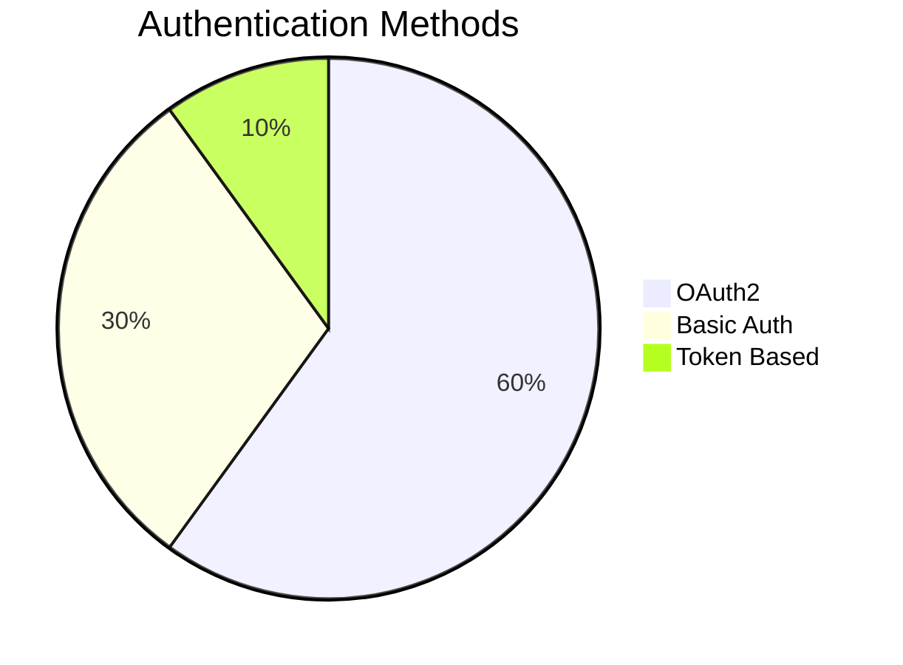

- OAuth2 (recommended for production)
- Basic Authentication (for development/testing)
- Custom token-based authentication

### 3. Pagination and Filtering

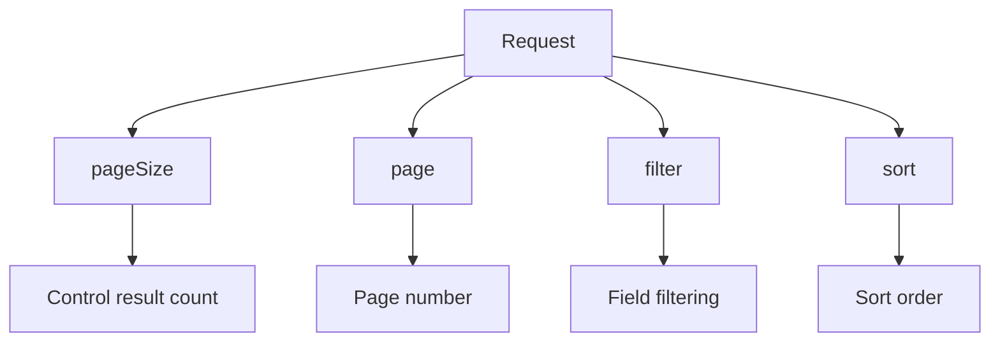

- `pageSize` and `page` parameters
- Field filtering with `filter` parameter
- Sorting with `sort` parameter

## Developer Workflow with Headless APIs

### 1. API Exploration

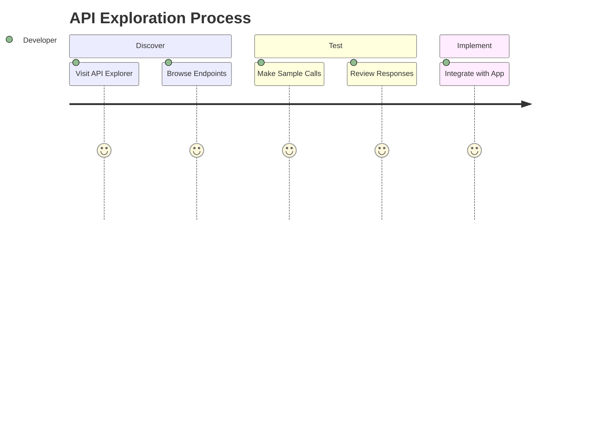

1. Use Liferay's built-in API Explorer (`/o/api`)
2. Review OpenAPI (Swagger) documentation
3. Test endpoints directly from the browser

### 2. Typical Integration Pattern

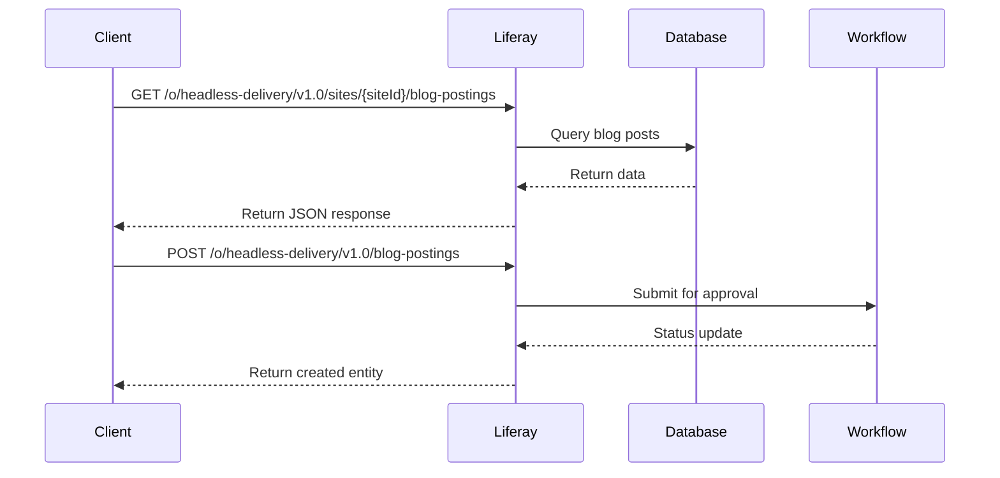

## Best Practices for Liferay Developers

1. **Use DTOs (Data Transfer Objects)**: Always work with the provided DTOs rather than internal Liferay models
2. **Handle Permissions**: Check scoped permissions before operations
3. **Implement Caching**: Cache frequently accessed data at client side
4. **Error Handling**: Properly handle Liferay-specific error codes
5. **Batch Operations**: Use batch endpoints for bulk operations

## Advanced Features

### 1. GraphQL Support

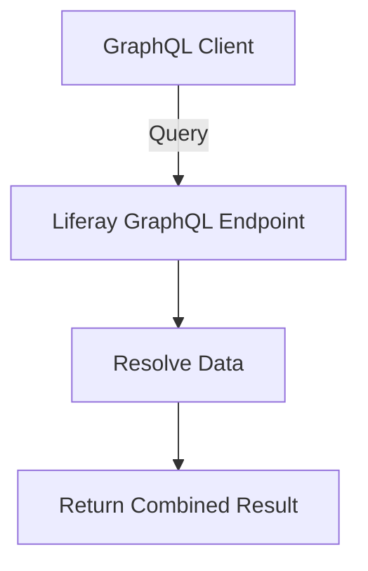

- Single endpoint for complex queries
- Reduced over-fetching of data
- Type-safe operations

### 2. Webhooks

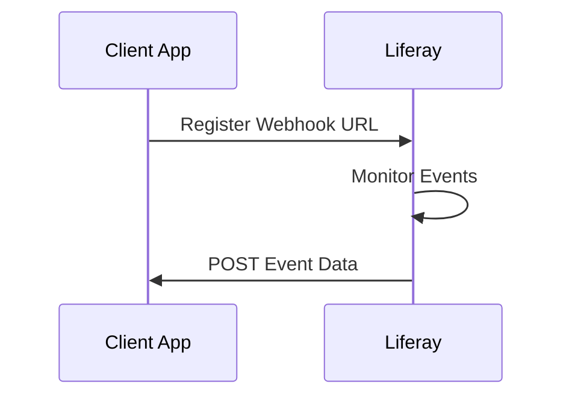

- Subscribe to system events
- Receive real-time notifications
- Implement event-driven architectures

## Versioning Strategy

Liferay maintains API versioning through the URL path:

```
/o/[api-name]/v[version-number]/[resource-path]
```

Example:

```
/o/headless-delivery/v1.0/sites/20121/blog-postings
```

## Development Tools

1. **Liferay API Explorer**: Built-in interactive documentation
2. **Postman**: API testing and collection management
3. **OpenAPI Generator**: Client SDK generation
4. **Liferay Workspace**: For custom API extensions

## Custom Headless APIs

Developers can create custom headless APIs using:

- **JAX-RS** annotations
- **OpenAPI** specifications
- **GraphQL** extensions

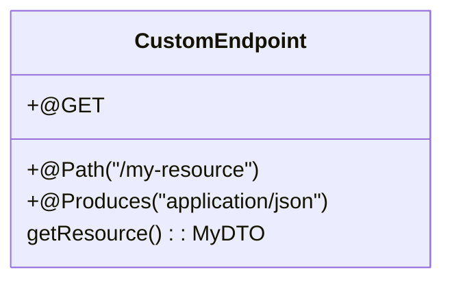

## Conclusion

This comprehensive approach to Liferay Headless APIs provides developers with the flexibility to build modern, decoupled applications while leveraging Liferay's robust content and user management capabilities.
