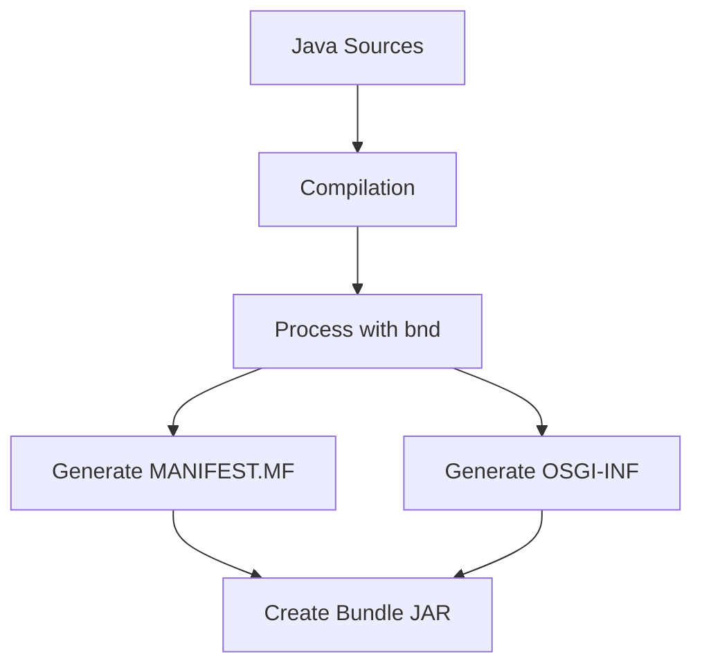
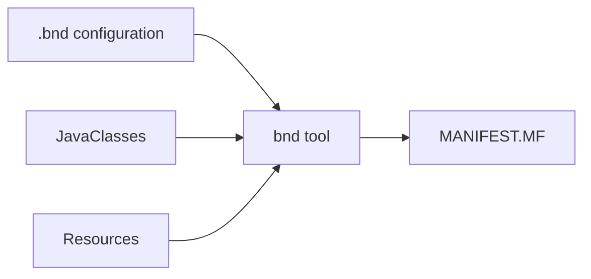

The `.bnd` file is a configuration file used in OSGi development (including Liferay) to define how Java classes should be packaged into OSGi bundles. It's a critical component in the build process that generates the proper OSGi manifest entries.

## Basic Structure of a `.bnd` File

A typical `.bnd` file contains directives that control:

- Bundle identity
- Package imports and exports
- Bundle classpath
- OSGi component declarations
- Build instructions

Example basic structure:

```
Bundle-Name: My Awesome Bundle
Bundle-SymbolicName: com.example.my.bundle
Bundle-Version: 1.0.0
Export-Package: com.example.api.*
Import-Package: org.osgi.framework.*, *
```

## Key Sections and Directives

### 1. Bundle Identification

```
Bundle-Name: My Project
Bundle-SymbolicName: com.example.project
Bundle-Version: 1.2.3
```

- **Bundle-SymbolicName**: Unique identifier (reverse domain name convention)
- **Bundle-Version**: Must follow OSGi versioning (major.minor.micro.qualifier)

### 2. Package Management

```
Export-Package: \
    com.example.api;version="1.2.3",\
    com.example.util;version="1.0.0"

Import-Package: \
    org.osgi.framework;version="[1.8,2)",\
    javax.servlet;version="[3.1,4)",\
    *
```

- **Export-Package**: Lists packages available to other bundles
- **Import-Package**: Lists required packages (wildcard `*` for automatic calculation)

### 3. Classpath and Resources

```
-classpath: \
    bin,\
    lib/dependency1.jar,\
    lib/dependency2.jar

-include: \
    OSGI-INF/metatype/metatype.xml,\
    META-INF/resources/icons
```

### 4. OSGi Components

```
Service-Component: \
    OSGI-INF/com.example.MyComponent.xml,\
    OSGI-INF/com.example.AnotherComponent.xml
```

## Advanced `.bnd` Features

### 1. Version Ranges

```
Import-Package: \
    org.osgi.service.log;version="[1.4,2)",\
    javax.servlet;version="[3.1,4)"
```

- `[1.4,2)` means ≥1.4.0 and <2.0.0

### 2. Conditional Packages

```
Private-Package: \
    com.example.internal.*,\
    !com.example.internal.test.*
```

### 3. Macros and Properties

```
project.version=1.2.3
Bundle-Version: ${project.version}
```

### 4. Plugin Configurations

```
-plugin: \
    aQute.bnd.deployer.repository.FixedIndexRepo;\
        name="My Repo";\
        locations="https://example.com/repo/index.xml"
```

## How `.bnd` Files Work in Liferay

In Liferay's build process (typically using Gradle or Maven):



## Liferay-Specific `.bnd` Directives

Liferay adds several custom directives:

```
Liferay-Require-SchemaVersion: 1.0.0
Liferay-Service: true
Web-ContextPath: /my-bundle
```

## Example Complete `.bnd` File

```
Bundle-Name: My Liferay Portlet
Bundle-SymbolicName: com.example.my.portlet
Bundle-Version: 1.0.0
Bundle-Category: Liferay

Export-Package: \
    com.example.api;version="1.0.0"

Import-Package: \
    com.liferay.portal.kernel.*;version="[7.0,8)",\
    javax.portlet;version="[3.0,4)",\
    javax.servlet;version="[3.1,4)",\
    *

-sources: true
Service-Component: OSGI-INF/*.xml

Liferay-Require-SchemaVersion: 1.0.0
Web-ContextPath: /my-portlet
```

## Integration with Build Tools

### With Maven (bnd-maven-plugin)

```xml
<plugin>
    <groupId>biz.aQute.bnd</groupId>
    <artifactId>bnd-maven-plugin</artifactId>
    <version>5.3.0</version>
    <executions>
        <execution>
            <goals>
                <goal>bnd-process</goal>
            </goals>
        </execution>
    </executions>
</plugin>
```

### With Gradle (Liferay Plugin)

```groovy
apply plugin: "com.liferay.plugin"

dependencies {
    compileOnly group: "com.liferay", name: "com.liferay.portal.kernel", version: "4.0.0"
}
```

## Best Practices

1. **Use semantic versioning** for all packages and bundles
2. **Be specific** with imports (avoid wildcards in production)
3. **Separate API and implementation** packages
4. **Keep private packages** properly hidden
5. **Use Liferay-specific directives** when needed
6. **Leverage build tool integration** rather than raw `.bnd` files

## Common Issues and Solutions

1. **Missing dependencies**: Verify all required packages are imported
2. **Version conflicts**: Specify exact version ranges
3. **Split packages**: Avoid same package across multiple bundles
4. **Classloading issues**: Properly export/import packages
5. **Circular dependencies**: Restructure your bundle design

## Debugging `.bnd` Files

1. Check generated `MANIFEST.MF` in final JAR
2. Use `bnd print` command to see effective bundle configuration
3. Examine build logs for bnd warnings
4. Use OSGi console to verify resolved dependencies

## Relationship with `MANIFEST.MF`

The `.bnd` file is processed to generate the final `MANIFEST.MF`:



## Advanced Topics

1. **Fragment bundles**: Special bundles that attach to host bundles
2. **Conditional compilation**: Different configurations per environment
3. **Multi-bundle projects**: Building several bundles from one project
4. **Custom bnd plugins**: Extending bnd functionality

## Conclusion

The `.bnd` file is a powerful configuration tool that:

- Simplifies OSGi bundle creation
- Handles complex dependency management
- Generates proper OSGi metadata
- Integrates with Liferay's specific requirements

Understanding `.bnd` files is essential for effective Liferay module development as they control the fundamental characteristics of your OSGi bundles.
