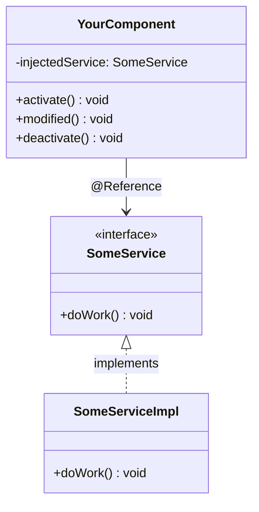

The `@Reference` annotation is a crucial part of Liferay's OSGi (Declarative Services) ecosystem, enabling dependency injection between components. This guide covers all aspects of `@Reference` with practical examples.

## 1. What is `@Reference`?

- **Purpose**: Declares a dependency on an OSGi service.
- **Effect**: The OSGi container injects the required service automatically.
- **Location**: From `org.osgi.service.component.annotations`.



## 2. Basic Syntax

```java
@Reference
private SomeService _someService;
```

## 3. Full Attribute Reference

| Attribute          | Type                    | Default     | Description                                                                 |
| ------------------ | ----------------------- | ----------- | --------------------------------------------------------------------------- |
| **`cardinality`**  | `ReferenceCardinality`  | `MANDATORY` | Defines if the reference is required (`MANDATORY`) or optional (`OPTIONAL`) |
| **`policy`**       | `ReferencePolicy`       | `STATIC`    | Dynamic vs static binding (`STATIC` or `DYNAMIC`)                           |
| **`policyOption`** | `ReferencePolicyOption` | `RELUCTANT` | How to handle multiple services (`GREEDY`, `RELUCTANT`)                     |
| **`target`**       | `String`                | `""`        | LDAP filter for service selection                                           |
| **`unbind`**       | `String`                | `"-unbind"` | Method to call when service is removed                                      |
| **`service`**      | `Class<?>`              | Inferred    | Explicit service interface type                                             |
| **`name`**         | `String`                | `""`        | Reference name for debugging                                                |

## 4. Common Usage Patterns

### 1. Mandatory Service (Default)

```java
@Reference
private UserLocalService _userLocalService;
```

- Fails if service is unavailable
- Most common pattern in Liferay

### 2. Optional Service

```java
@Reference(cardinality = ReferenceCardinality.OPTIONAL)
private volatile SomeOptionalService _optionalService;
```

- Component works even if service is missing
- Use `volatile` for dynamic cases

### 3. Filtered Reference (Using target)

```java
@Reference(
    target = "(component.name=com.example.MySpecialImpl)"
)
private MyInterface _specialService;
```

### 4. Dynamic Binding

```java
@Reference(
    policy = ReferencePolicy.DYNAMIC,
    policyOption = ReferencePolicyOption.GREEDY
)
private volatile SomeDynamicService _dynamicService;
```

- Handles service coming/going at runtime
- Common for connectors to external systems

### 5. With Unbind Method

```java
@Reference(unbind = "_unsetService")
private SomeService _service;

protected void _unsetService(SomeService service) {
    _service = null;
}
```

## 5. Advanced Scenarios

### Multiple Services Collection

```java
@Reference(
    cardinality = ReferenceCardinality.MULTIPLE,
    policy = ReferencePolicy.DYNAMIC
)
private volatile List<EventHandler> _eventHandlers;
```

### Ranked Services

```java
@Reference(
    target = "(service.ranking=100)",
    unbind = "_unsetHighPriorityService"
)
private HighPriorityService _highPriorityService;
```

## 6. Best Practices

1. **Prefer constructor injection** (Liferay 7.4+) when possible:

   ```java
   @Component(service = MyComponent.class)
   public class MyComponent {
       private final SomeService _someService;

       @Activate
       public MyComponent(@Reference SomeService someService) {
           _someService = someService;
       }
   }
   ```

2. **Use `volatile`** for dynamic references

3. **Always provide unbind methods** for complex dependencies

4. **Avoid field injection** in @ReferenceCardinality.MULTIPLE cases

## 7. Troubleshooting

| Issue                 | Solution                                                           |
| --------------------- | ------------------------------------------------------------------ |
| Null reference        | Check cardinality (should be MANDATORY for required services)      |
| Service not found     | Verify target filter and service availability (`lb` in Gogo shell) |
| Memory leaks          | Ensure proper unbind methods for dynamic references                |
| Circular dependencies | Use constructor injection or redesign component hierarchy          |

## 8. Real-World Liferay Example

```java
@Component(service = UserExport.class)
public class UserExport {

    @Reference
    private UserLocalService _userLocalService;

    @Reference(
        target = "(model.class.name=com.liferay.portal.kernel.model.User)",
        unbind = "-"
    )
    private ModelResourcePermission<User> _userModelResourcePermission;

    @Reference(
        cardinality = ReferenceCardinality.OPTIONAL,
        policy = ReferencePolicy.DYNAMIC
    )
    private volatile AuditMessageProcessor _auditProcessor;
}
```

## 9. Conclusion

- `@Reference` is Liferay's primary dependency injection mechanism
- Supports both static and dynamic service binding
- Proper configuration prevents runtime issues
- Combines well with `@Component` for modular architecture

**Next Steps:**

1. Explore OSGi service trackers for advanced scenarios
2. Learn about component lifecycle with `@Activate`/`@Deactivate`
3. Study Liferay's service builder pattern

🚀 **Pro Tip:** Use `@Reference` with `@Component(service=...)` to build clean, maintainable services!
