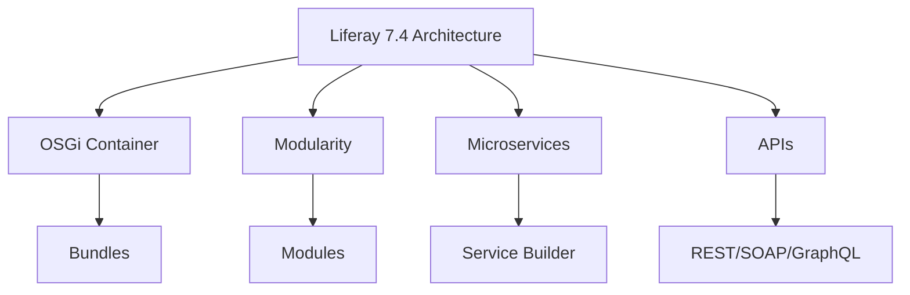
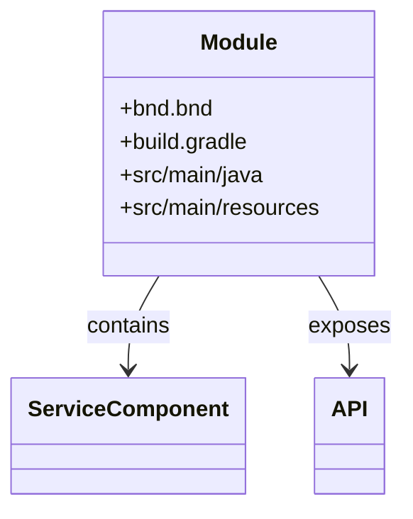
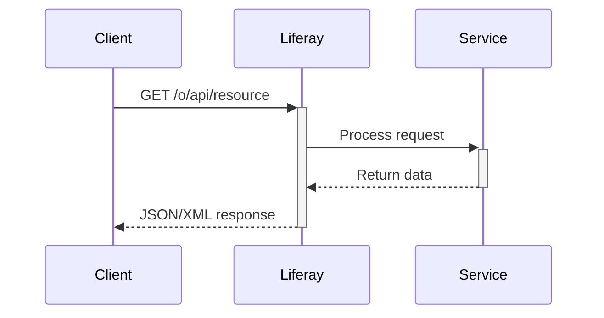
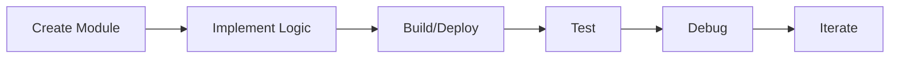
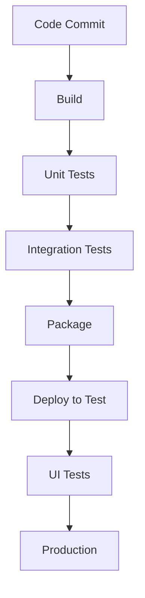

Liferay 7.4 is the latest `DXP` (**Digital Experience Platform**) version from Liferay, built on OSGi (**Open Service Gateway Initiative**) architecture. As a Liferay developer, you'll work with a modular, enterprise-grade platform for building digital experiences, portals, intranets, and custom web applications.



## Core Concepts

### 1. OSGi and Modular Architecture

Liferay 7.4 uses OSGi for:

- Dynamic module system
- Service registry
- Lifecycle management
- Dependency management

### 2. Workspace Structure

A standard Liferay workspace contains:

```
liferay-workspace/
├── configs/
├── gradle/
├── modules/
│   ├── apps/
│   ├── core/
│   └── themes/
├── themes/
└── build.gradle
```

## Development Components

### 1. Modules

The building blocks of Liferay applications:



### 2. Service Builder

Liferay's ORM and service generation tool:

1. Define entities in `service.xml`
2. Run `gradle buildService`
3. Service Builder generates:
   - Model classes
   - Persistence layer
   - Service layers
   - API interfaces

### 3. MVC Portlet

Traditional portlet development approach:

```java
@Component(
    immediate = true,
    property = {
        "javax.portlet.name=" + MyPortletKeys.MY_PORTLET,
        "mvc.command.name=/my/action"
    },
    service = MVCActionCommand.class
)
public class MyActionCommand implements MVCActionCommand {
    // Your action code
}
```

### 4. Frontend Development

Liferay 7.4 supports multiple approaches:

- **Traditional**: JSP, FreeMarker
- **Modern**: React, Angular, Vue.js via Liferay JS Toolkit
- **Web Components**: Using Clay UI and Metal.js

## Key APIs and Services

### 1. Headless APIs

Liferay 7.4 provides extensive headless delivery:



### 2. Workflow Framework

Customizable workflow engine:

- Kaleo workflow engine
- Create custom workflow handlers
- Integrate with external systems

### 3. Search and Indexing

- Elasticsearch integration
- Custom document fields
- Search facets and filters

## Development Workflow

### 1. Setup

1. Install Liferay Workspace
2. Configure Gradle properties
3. Set up target platform

### 2. Development Cycle



### 3. Deployment Options

- Local development (Docker/Standalone)
- On-premise servers
- Cloud (Liferay DXP Cloud)

## Advanced Topics

### 1. Customization Techniques

- Extend core services using OSGi components
- Override JSPs with module fragments
- Create custom field types
- Develop custom asset renderers

### 2. Performance Considerations

- Cluster-aware coding
- Caching strategies
- Database optimization
- Frontend performance

### 3. Security Best Practices

- Implement permission checking
- Secure service endpoints
- Validate all inputs
- Follow OWASP guidelines

## Tools and Utilities

### 1. Liferay Developer Studio

- Eclipse-based IDE
- Code templates
- Debugging tools

### 2. Blade CLI

```bash
blade create -t mvc-portlet -p com.example.my.portlet my-portlet-project
```

### 3. Gogo Shell

For runtime inspection and management:

```
g! lb | grep my.module
g! services | grep MyService
```

## Testing Strategies

1. Unit tests (JUnit/Mockito)
2. Integration tests (Arquillian)
3. UI tests (Selenium)
4. Performance tests (JMeter)

## Migration Path

When upgrading from previous versions:

1. Analyze deprecated APIs
2. Convert plugins to OSGi modules
3. Update dependencies
4. Test compatibility

## Sample Module Structure

```
my-custom-module/
├── bnd.bnd
├── build.gradle
├── src/
│   ├── main/
│   │   ├── java/
│   │   │   └── com/example/
│   │   │       ├── constants/
│   │   │       ├── portlet/
│   │   │       └── service/
│   │   └── resources/
│   │       ├── META-INF/
│   │       │   └── resources/
│   │       └── service.properties
│   └── test/
└── service.xml
```

## Continuous Integration



## Conclusion

As a Liferay 7.4 developer, you're working with a powerful, modular platform that requires understanding of:

- OSGi concepts
- Modern web development
- Service-oriented architecture
- Headless delivery
- Cloud-native principles

The platform offers flexibility but requires disciplined development practices to leverage its full potential.
