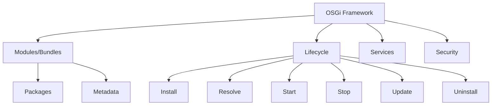
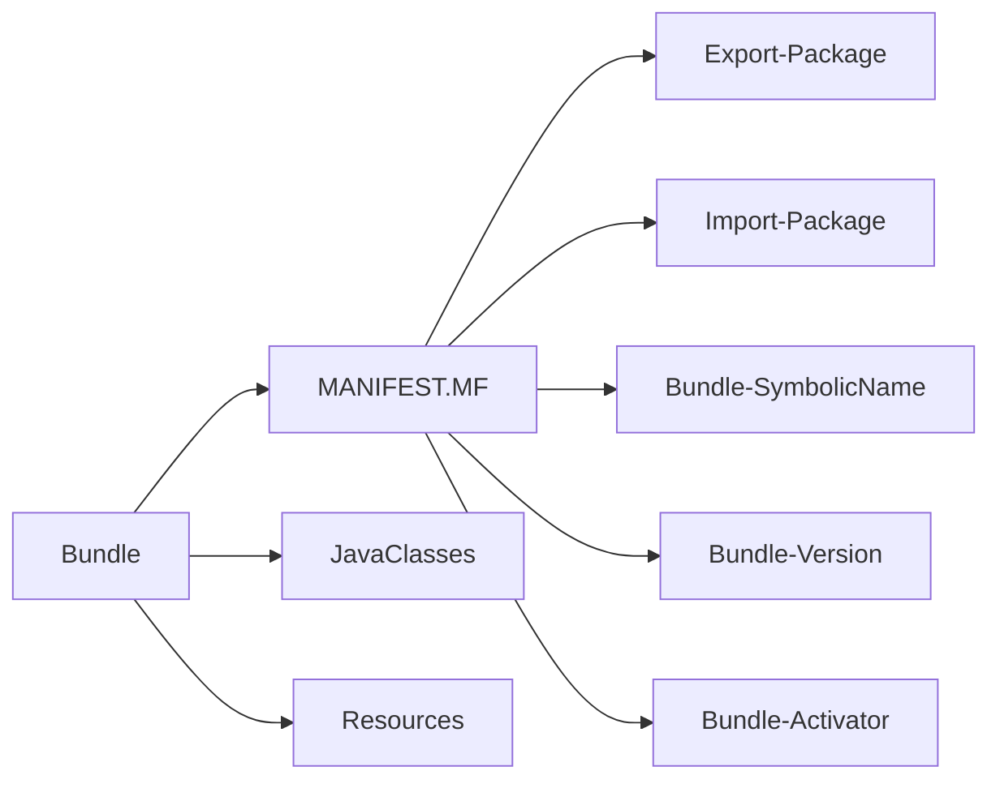
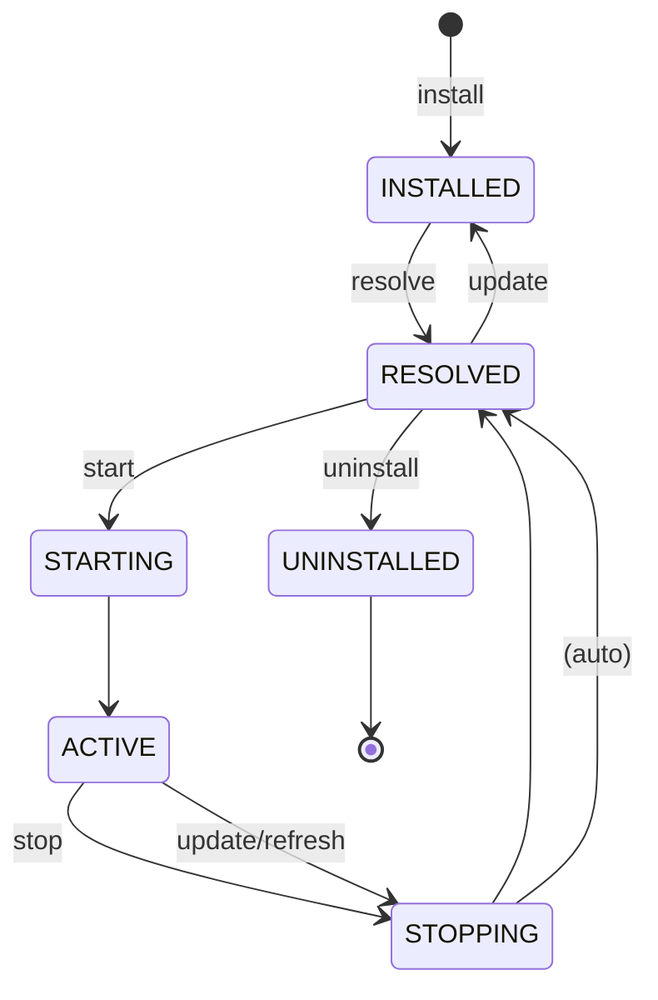
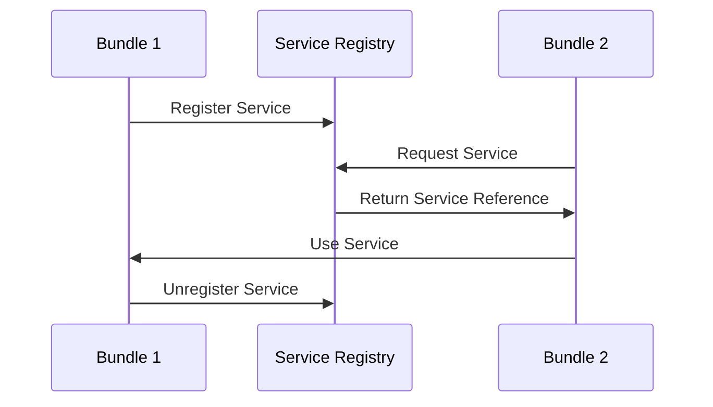
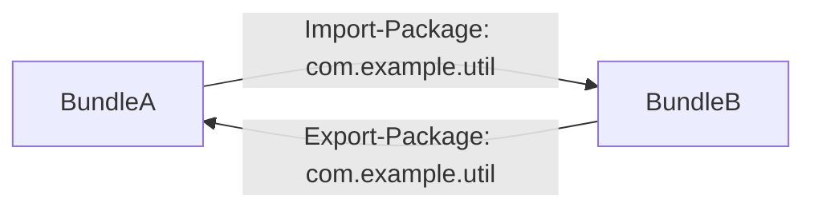
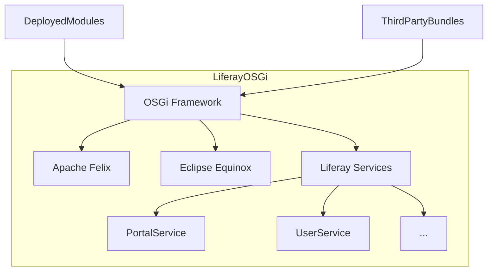
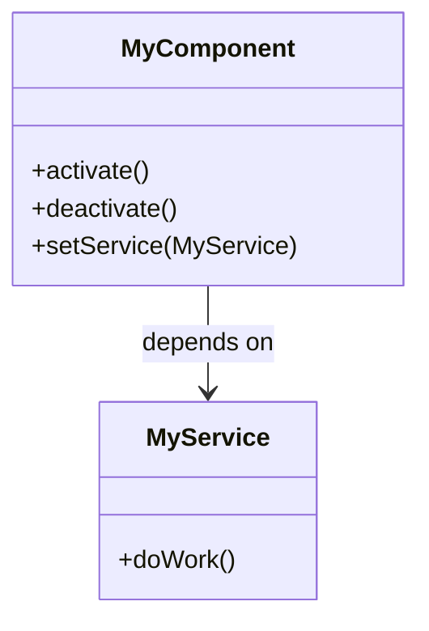
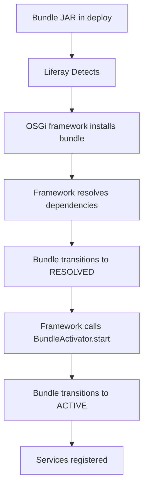

OSGi (**Open Service Gateway Initiative**) is a modular system and service platform for Java that forms the foundation of Liferay DXP 7.4's architecture. It provides a dynamic module system that allows for better modularity, versioning, and lifecycle management of components.

## OSGi Architecture Overview



## Key OSGi Concepts

### 1. Bundles

The fundamental unit of modularity in OSGi - a JAR file with additional metadata.

### 2. Services

The mechanism for bundles to communicate dynamically.

### 3. Lifecycle

How bundles are installed, started, stopped, updated, and uninstalled.

### 4. Modules

The isolation mechanism that keeps bundles separate yet allows controlled interaction.

## OSGi Bundle Structure



## Bundle Lifecycle in Detail



### Lifecycle States Explained:

1. **INSTALLED**: Bundle is installed but cannot be used yet
2. **RESOLVED**: All dependencies are resolved, ready to start
3. **STARTING**: Transition state to ACTIVE
4. **ACTIVE**: Bundle is fully operational
5. **STOPPING**: Transition state from ACTIVE to RESOLVED
6. **UNINSTALLED**: Bundle is removed but might still be in use

## OSGi Services

Services are the primary way bundles interact in OSGi:



## Dependency Management

OSGi uses strict dependency management through:

1. **Import-Package**: What packages a bundle needs
2. **Export-Package**: What packages a bundle provides
3. **Require-Bundle**: Direct bundle dependencies (generally discouraged)



## OSGi in Liferay 7.4

Liferay 7.4 uses OSGi as its core modularization technology:

1. **All core functionality** is split into OSGi bundles
2. **Custom modules** are deployed as OSGi bundles
3. **Service Builder** generates OSGi components
4. **Gogo shell** provides command-line interaction

### Liferay's OSGi Container Architecture



## Bundle Development Process

1. **Create**: Develop your Java classes and components
2. **Configure**: Add OSGi metadata (MANIFEST.MF or annotations)
3. **Build**: Use Bnd or Maven to create the bundle JAR
4. **Deploy**: Copy to Liferay's deploy folder
5. **Manage**: Monitor through Gogo shell or Control Panel

## OSGi Manifest Headers

Key headers in MANIFEST.MF:

```
Bundle-SymbolicName: com.example.my.bundle
Bundle-Version: 1.0.0
Bundle-Activator: com.example.Activator
Import-Package: org.osgi.framework;version="[1.8,2)"
Export-Package: com.example.util;version="1.0.0"
Service-Component: OSGI-INF/*.xml
```

## OSGi Component Model

Liferay primarily uses Declarative Services (DS):



## Deployment Process in Liferay



## Debugging OSGi Bundles

Common tools:

1. Gogo shell commands (lb, services, bundles)
2. Liferay's Control Panel → Gogo Shell
3. Felix Web Console (if installed)
4. Logs in ${liferay.home}/logs

## Best Practices

1. Use semantic versioning for bundles and packages
2. Prefer Declarative Services over BundleActivator
3. Keep bundles small and focused
4. Use proper package exports with versions
5. Avoid Require-Bundle when possible
6. Handle dynamic services properly

## Common Pitfalls

1. Missing dependencies (Unsatisfied constraints)
2. Version conflicts
3. Classloading issues
4. Service reference leaks
5. Improper lifecycle management
6. Memory leaks from unregistered services

## Advanced Topics

1. OSGi Subsystems
2. Fragment bundles
3. OSGi Remote Services
4. Configuration Admin
5. Event Admin
6. Metatype services

## Conclusion

OSGi provides Liferay 7.4 with a powerful modular architecture that enables:

- True modularity with proper isolation
- Dynamic lifecycle management
- Service-oriented architecture
- Versioned dependencies
- Better classloading

Understanding OSGi is fundamental to effective Liferay development as it underpins the entire platform's architecture.
