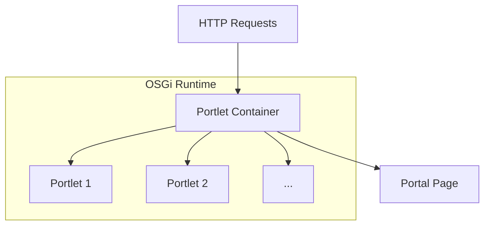
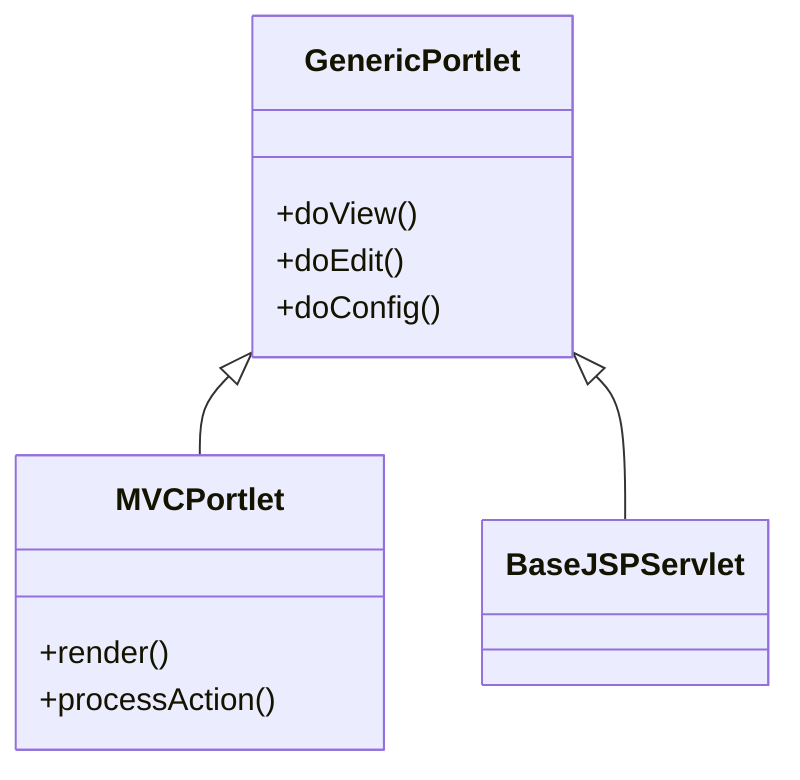
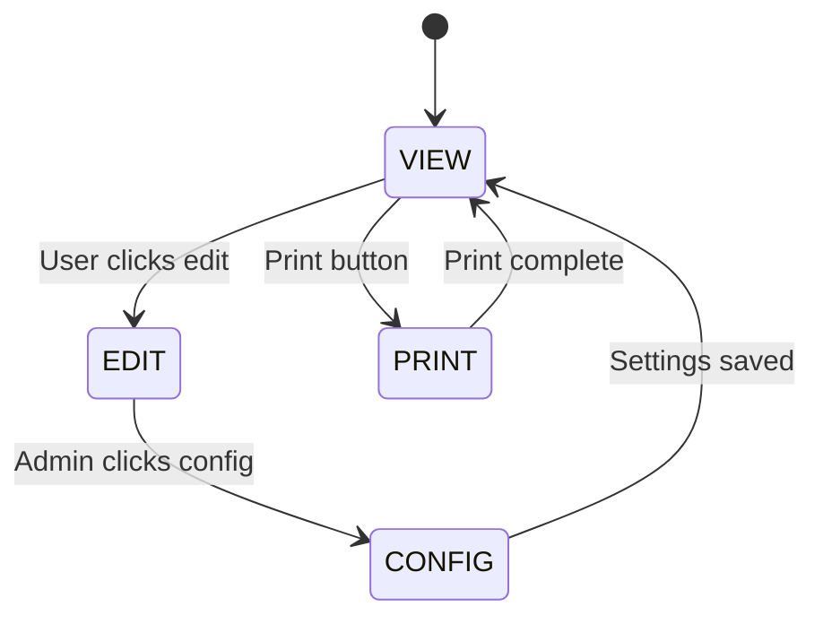
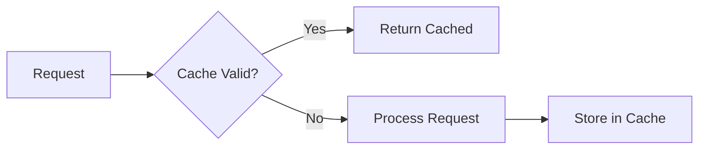
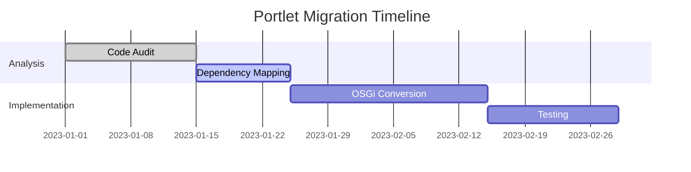

## 1. Portlet Core Architecture

### Portlet Container & OSGi Integration



Key Components:

- **Portlet Container**: Manages lifecycle (init, render, destroy)
- **OSGi Service Registry**: Enables dependency injection
- **Portlet Bridge**: Connects portlets to Liferay's rendering engine

### Portlet Class Hierarchy



## **2. Advanced Portlet Modes**

### Custom Portlet Modes

```java
@PortletConfiguration(
    portletName = "myPortlet",
    modes = {
        @PortletMode(name = "print", markup = "text/html"),
        @PortletMode(name = "dashboard")
    }
)
public class MyPortlet extends GenericPortlet {
    @Override
    protected void doPrint(RenderRequest request, RenderResponse response) {
        // Print-specific rendering
    }
}
```

### Mode Transition Flow



## **3. Inter-Portlet Communication (IPC)**

### Event-Based IPC

```java
// Sender Portlet
@ProcessAction(name = "sendData")
public void sendData(ActionRequest request, ActionResponse response) {
    response.setEvent("user/data", userData);
}

// Receiver Portlet
@ProcessEvent(qname = "{http://example.com}user/data")
public void receiveData(EventRequest request, EventResponse response) {
    UserData data = (UserData)request.getEvent();
}
```

### Public Render Parameters

```xml
<!-- portlet.xml -->
<portlet>
    <supported-public-render-parameter>user_id</supported-public-render-parameter>
</portlet>

<!-- liferay-portlet.xml -->
<portlet>
    <public-render-parameter>
        <identifier>user_id</identifier>
        <qname>[http://example.com]user_id</qname>
    </public-render-parameter>
</portlet>
```

## **4. Advanced Configuration**

### Portlet Preferences (Database-Persisted)

```java
@PortletConfiguration(
    portletName = "configurablePortlet",
    preferences = {
        @PortletPreference(
            name = "colorScheme",
            value = "{\"default\":\"blue\",\"options\":[\"red\",\"green\"]}"
        )
    }
)
public class ConfigurablePortlet extends GenericPortlet {
    // ...
}
```

### Dynamic Preference Management

```java
PortletPreferences prefs = request.getPreferences();
prefs.setValue("itemsPerPage", "10");
prefs.store();  // Persists to database
```

## **5. Performance Optimization**

### Caching Strategies



Implementation:

```java
@Header(
    name = "Cache-Control",
    value = "public, max-age=3600"  // 1 hour cache
)
public class CachedPortlet extends GenericPortlet {
    // ...
}
```

### Resource Serving Best Practices

```java
@ServeResource(
    resourceID = "chartData",
    contentType = "application/json"
)
public void serveChartData(ResourceRequest request, ResourceResponse response) {
    // Generate and stream JSON
}
```

## **6. Security Considerations**

### Permission Checking

```java
if (PortletPermissionUtil.contains(
    permissionChecker,
    plid,
    portletId,
    ActionKeys.VIEW)) {
    // Render content
}
```

### CSRF Protection

```html
<portlet:actionURL var="formAction">
  <portlet:param
    name="<%=Constants.CSRF_TOKEN%>"
    value="<%=request.getAttribute(Constants.CSRF_TOKEN)%>"
  />
</portlet:actionURL>
```

## **7. Migration Considerations (6.2 → 7.4)**

### Key Changes

| Liferay 6.2           | Liferay 7.4        |
| --------------------- | ------------------ |
| PortletSpec 2.0       | PortletSpec 3.0    |
| Plugin SDK            | Blade CLI/Gradle   |
| Spring Portlet MVC    | OSGi DS Components |
| `liferay-portlet.xml` | OSGi Metadata      |

### Migration Path



## **8. Debugging & Troubleshooting**

### Common Issues

1. **ClassCastException** - Check OSGi service versions
2. **Portlet Not Appearing** - Verify `bnd.bnd` headers
3. **Preferences Not Saving** - Check permission constraints

### Diagnostic Tools

```bash
# Gogo Shell Commands:
lb | grep my.portlet  # Find bundle
services | grep Portlet  # Check registrations
log:display  # View logs
```

## **9. Real-World Implementation Example**

### Complete Dashboard Portlet

```java
@Component(
    property = {
        "com.liferay.portlet.display-category=category.sample",
        "com.liferay.portlet.instanceable=true",
        "javax.portlet.name=com_example_DashboardPortlet"
    },
    service = Portlet.class
)
public class DashboardPortlet extends MVCPortlet {

    @Reference
    private UserLocalService _userService;

    @Override
    public void render(RenderRequest request, RenderResponse response) {
        request.setAttribute("userCount", _userService.getUsersCount());
        super.render(request, response);
    }

    @ServeResource
    public void serveCharts(ResourceRequest request, ResourceResponse response) {
        // Return JSON data for AJAX charts
    }
}
```

## **10. Future-Proofing**

### Headless Portlet Patterns

```java
@ProviderType
public interface MyPortletService {
    String getDataAsJson();
}

@Component(service = MyPortletService.class)
public class MyPortletServiceImpl implements MyPortletService {
    // ...
}
```

### Web Components Integration

```javascript
class MyPortletElement extends HTMLElement {
  connectedCallback() {
    this.innerHTML = `<h1>Portlet as Web Component</h1>`;
  }
}
customElements.define("my-portlet", MyPortletElement);
```

## **Next Steps for Mastery**

1. **Deep Dive into OSGi Services**:

   ```bash
   blade create -t service my-service-api
   blade create -t service-wrapper my-service-override
   ```

2. **Explore Liferay's Frontend Toolkit**:

   ```bash
   npm init @liferay/js-portlet@latest
   ```

3. **Performance Tuning**:
   - Implement Fragment Caching
   - Study Portlet Filter Chains
