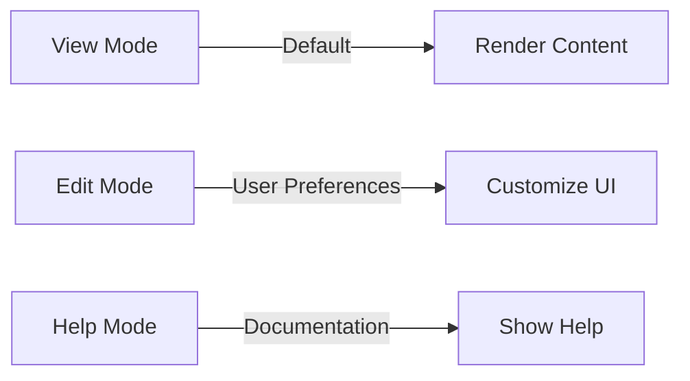
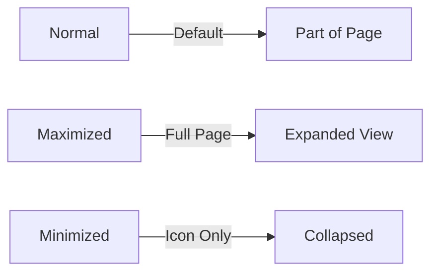
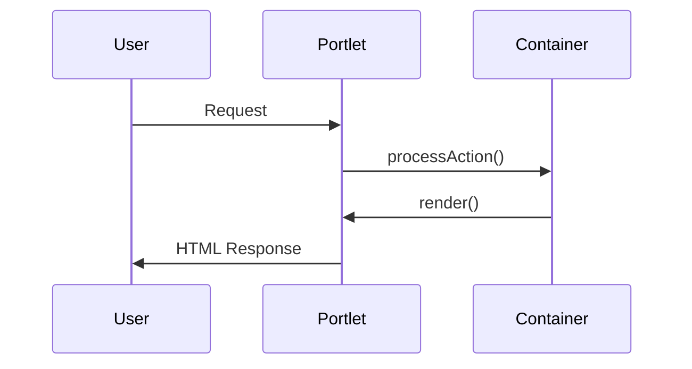

Portlets are the building blocks of Liferay applications. They are modular, reusable web components that render fragments of HTML inside a portal page.

> **_NOTE:_** This document is compiled in the reference of Liferay 7.4 and above

---

## 1. Portlet Basics

### What is a Portlet?

- A **Java-based web component** that generates dynamic content.
- Runs inside a **Portlet Container** (Liferay’s OSGi runtime).
- Supports multiple **modes** (View, Edit, Config) and **window states** (Normal, Maximized, Minimized).

### Portlet Modes



### Window States



---

## 2. Types of Portlets

### MVC Portlet (Traditional)

- Uses **JSPs** for rendering.
- Best for simple UIs and legacy applications.

#### **Example Code**

```java
@Component(
    immediate = true,
    property = {
        "javax.portlet.name=com_example_MyPortlet",
        "javax.portlet.display-name=My MVC Portlet"
    },
    service = Portlet.class
)
public class MyMVCPortlet extends MVCPortlet {
    @Override
    public void render(RenderRequest request, RenderResponse response) {
        request.setAttribute("message", "Hello from MVC Portlet!");
        super.render(request, response);
    }
}
```

### JS Portlet (React, Angular, Vue)

- Uses **JavaScript frameworks** (via Liferay’s `npm` tools).
- Best for **modern SPAs** inside Liferay.

#### Example (React Portlet)

```bash
blade create -t npm-react-portlet my-react-portlet
```

```jsx
// src/index.js
export default function () {
  return <h1>Hello from React Portlet!</h1>;
}
```

### Spring MVC Portlet

- Uses **Spring Framework** for dependency injection.
- Best for **enterprise apps** needing Spring integration.

#### **Example**

```java
@Controller
@RequestMapping("VIEW")
public class MySpringPortlet {
    @RenderMapping
    public String view(Model model) {
        model.addAttribute("message", "Hello from Spring Portlet!");
        return "view";
    }
}
```

### OSGi Declarative Services (DS) Portlet

- Uses **OSGi annotations** for lightweight services.
- Best for **modular** and **scalable** apps.

#### **Example**

```java
@Component(
    property = "javax.portlet.name=com_example_MyDSPortlet",
    service = Portlet.class
)
public class MyDSPortlet extends GenericPortlet {
    @Override
    protected void doView(RenderRequest request, RenderResponse response) {
        response.getWriter().write("Hello from DS Portlet!");
    }
}
```

---

## 3. Portlet Anatomy

### **Key Files in a Portlet Project**

```
my-portlet/
├── src/
│   ├── main/
│   │   ├── java/         # Portlet class
│   │   ├── resources/    # Language properties
│   │   └── webapp/       # JSPs, JS, CSS
│   └── test/
├── bnd.bnd               # OSGi metadata
└── build.gradle          # Build script
```

### Portlet Lifecycle



---

## 4. Portlet Modes & Preferences

### View Mode (Default)

- Displays the main UI.
- Defined in `doView()` (GenericPortlet) or `@RenderMapping` (Spring).

### Edit Mode

- Allows user customization.
- Example:

```java
@RenderMapping(mode = "edit")
public String edit() {
    return "edit-mode";
}
```

### Config Mode (Admin Settings)

- Configured via `portlet.xml`:

```xml
<portlet>
    <portlet-preferences>
        <preference>
            <name>color</name>
            <value>blue</value>
        </preference>
    </portlet-preferences>
</portlet>
```

---

## 5. Key Portlet Features in Liferay 7.4

| Feature                      | Description                       |
| ---------------------------- | --------------------------------- |
| **AJAX Support**             | `ResourceURL` for dynamic updates |
| **Public Render Parameters** | Share data between portlets       |
| **Portlet Filters**          | Modify requests/responses         |
| **Events**                   | IPC (Inter-Portlet Communication) |
| **Asset Framework**          | Tagging, categorization           |

---

## 6. Deployment Options

1. **Auto-Deploy (Hot Deploy)**
   ```bash
   cp my-portlet.jar $LIFERAY_HOME/deploy/
   ```
2. **Blade CLI**
   ```bash
   blade deploy
   ```
3. **Gradle**
   ```bash
   ./gradlew deploy
   ```

---

## **7. Best Practices**

✔ **Use JS Portlets for modern UIs**  
✔ **Leverage OSGi services for modularity**  
✔ **Follow Liferay’s naming conventions**  
✔ **Use portlet preferences for customization**

---

## **Next Steps**

1. Try creating a sample portlet:
   ```bash
   blade create -t mvc-portlet -p com.example.myportlet MyPortlet
   ```
2. Explore [Liferay’s official docs](https://learn.liferay.com/).
