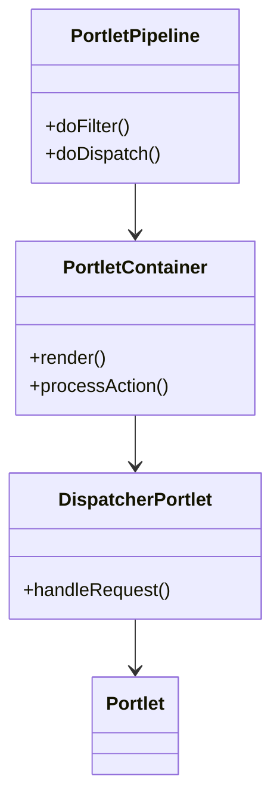
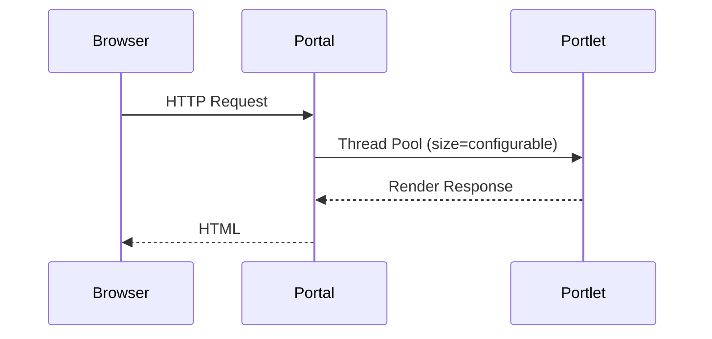
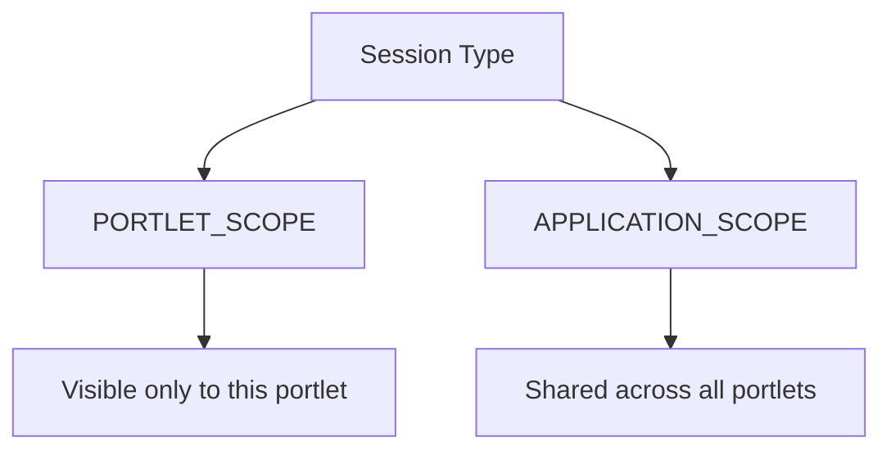
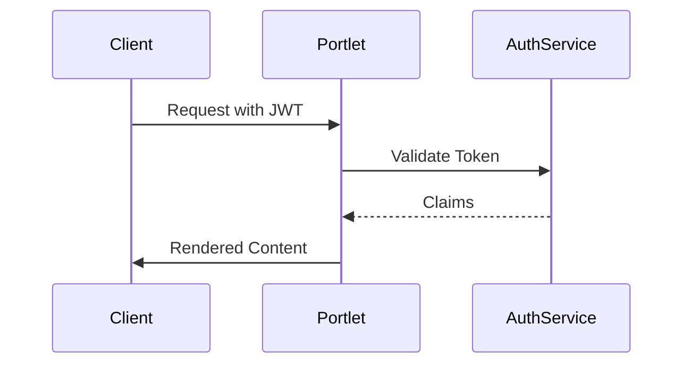

## 1. Portlet Architecture: Under the Hood

### OSGi Service Dynamics



**Key Insights:**

- **PortletPipeline**: Handles request preprocessing (filters, security)
- **PortletContainer**: Manages state and lifecycle
- **DispatcherPortlet**: Bridges HTTP requests to portlet instances

### Threading Model



**Configuration (portal-ext.properties):**

```properties
portlet.executor.core.pool.size=20
portlet.executor.max.pool.size=100
portlet.executor.keep.alive.time=60000
```

## 2. Advanced Render Mechanics

### Dynamic Resource Serving

```java
@ServeResource(
    resourceID = "dynamicData",
    contentType = "application/json",
    characterEncoding = "UTF-8"
)
public void serveDynamicData(ResourceRequest request, ResourceResponse response)
    throws IOException {

    try (OutputStream out = response.getPortletOutputStream()) {
        JsonGenerator generator = Json.createGenerator(out);
        generator.writeStartObject()
            .write("timestamp", System.currentTimeMillis())
            .write("data", fetchLiveData())
            .writeEnd();
        generator.flush();
    }
}
```

**Performance Optimization:**

- Use `@Header(name="Cache-Control", value="max-age=300")` for cacheable resources
- Implement `ETag` support for conditional requests

### Fragment Caching

```xml
<!-- liferay-portlet.xml -->
<portlet>
    <fragment-cache>true</fragment-cache>
    <cache-scope>public</cache-scope>
    <cache-timeout>600</cache-timeout> <!-- 10 minutes -->
</portlet>
```

**Programmatic Control:**

```java
CachePortletResponseUtil.setCacheHeaders(
    resourceResponse,
    CacheControl.maxAge(10, TimeUnit.MINUTES)
);
```

## 3. Portlet State Management

### Portlet Session Strategies



**Best Practices:**

- Use `PortletSessionUtil.getPortletSession()` for proper scoping
- For clustered environments:
  ```java
  session.setAttribute("data", data, PortletSession.APPLICATION_SCOPE);
  ```

### Distributed State with Redis

```java
@Component(service = PortletStateManager.class)
public class RedisPortletStateManager {

    @Reference
    private RedisConnection _redis;

    public void saveState(String portletId, Serializable state) {
        _redis.execute(connection -> {
            connection.stringCommands().set(
                ("portlet:" + portletId).getBytes(),
                serialize(state)
            );
            return null;
        });
    }
}
```

## 4. Portlet Security Implementation Patterns

### Fine-Grained Permission Checks

```java
public void render(RenderRequest request, RenderResponse response) {
    if (!PortletPermissionUtil.contains(
        PermissionThreadLocal.getPermissionChecker(),
        PortletKeys.PREFS_OWNER_TYPE_LAYOUT,
        PortletPermission.ACTION_CONFIGURATION)) {
        throw new PrincipalException();
    }
    // Proceed with admin rendering
}
```

### JWT Authentication Flow



**Implementation:**

```java
@Header(
    name = "Authorization",
    value = "Bearer ${request.headers['Authorization']}"
)
public class SecurePortlet extends GenericPortlet {
    // ...
}
```

## 5. Performance Optimization

### Lazy Loading Pattern

```java
@Component(service = PortletDataLoader.class)
public class AsyncDataLoader {

    @Reference
    private ExecutorService _executor;

    public <T> CompletableFuture<T> loadData(Supplier<T> supplier) {
        return CompletableFuture.supplyAsync(supplier, _executor);
    }
}

// In Portlet:
request.setAttribute(
    "asyncData",
    dataLoader.loadData(() -> fetchHeavyDataSet())
);
```

### Connection Pooling

```java
@Reference(target = "(pool.name=portal)")
private DataSource _dataSource;

public List<Data> fetchData() {
    try (Connection con = _dataSource.getConnection();
         PreparedStatement ps = con.prepareStatement("SELECT...")) {
        // Execute query
    }
}
```

## 6. Debugging Toolkit

### Diagnostic Endpoints

```java
@ServeResource(resourceID = "diagnostics")
public void serveDiagnostics(ResourceRequest request, ResourceResponse response) {
    response.setContentType("text/plain");
    PrintWriter writer = response.getWriter();
    writer.println("Thread: " + Thread.currentThread().getName());
    writer.println("Session: " + request.getPortletSession().getId());
    writer.println("Preferences: " + request.getPreferences().getMap());
}
```

### Performance Metrics

```java
@Metric(name = "render_time", description = "Portlet render duration")
private Counter renderTime;

@Override
protected void doView(RenderRequest request, RenderResponse response) {
    long start = System.nanoTime();
    try {
        // Rendering logic
    } finally {
        renderTime.record(
            System.nanoTime() - start,
            TimeUnit.NANOSECONDS
        );
    }
}
```

## 7. Real-World Enterprise Pattern

### Multi-Tenant Portlet

```java
@Component(
    property = {
        "com.liferay.portlet.tenantable=true",
        "javax.portlet.name=com_example_TenantAwarePortlet"
    },
    service = Portlet.class
)
public class TenantAwarePortlet extends GenericPortlet {

    @Reference
    private CompanyLocalService _companyService;

    @Override
    protected void doView(RenderRequest request, RenderResponse response) {
        long companyId = PortalUtil.getCompanyId(request);
        Company company = _companyService.getCompany(companyId);
        request.setAttribute("company", company);
    }
}
```

### Circuit Breaker Pattern

```java
@Reference
private CircuitBreakerFactory _circuitBreakerFactory;

public String fetchExternalData() {
    return _circuitBreakerFactory.create("externalService").run(
        () -> externalService.call(),
        throwable -> "Fallback data"
    );
}
```

## 8. Testing Strategies

### Unit Test Example

```java
public class MyPortletTest {

    @Test
    public void testRender() throws Exception {
        // Setup
        RenderRequest request = new MockRenderRequest();
        RenderResponse response = new MockRenderResponse();

        // Execute
        new MyPortlet().doView(request, response);

        // Verify
        assertThat(response.getContent()).contains("Expected Content");
    }
}
```

### Integration Test

```java
@RunWith(PortletTestRunner.class)
@PortletTestConfiguration(
    portletName = "myPortlet",
    portletClass = MyPortlet.class
)
public class MyPortletIT {

    @Inject
    private PortletRequestDispatcher _dispatcher;

    @Test
    public void testFullRender() {
        MockRenderRequest request = new MockRenderRequest();
        MockRenderResponse response = new MockRenderResponse();

        _dispatcher.render(request, response);

        assertThat(response.getContentAsString())
            .contains("Expected Markup");
    }
}
```

## 9. Future-Forward Techniques

### Portlet as Microservice

```java
@Component(
    property = {
        "service.exported.interfaces=*",
        "service.exported.configs=org.apache.cxf.rs",
        "javax.ws.rs=true"
    },
    service = MyPortletService.class
)
@Path("/my-portlet-api")
public class MyPortletServiceImpl implements MyPortletService {

    @GET
    @Path("/data")
    @Produces("application/json")
    public String getData() {
        return "{ \"status\": \"OK\" }";
    }
}
```

### WASM Integration

```javascript
// In portlet's JS
WebAssembly.instantiateStreaming(fetch("module.wasm")).then((wasm) => {
  wasm.instance.exports.processData();
});
```
