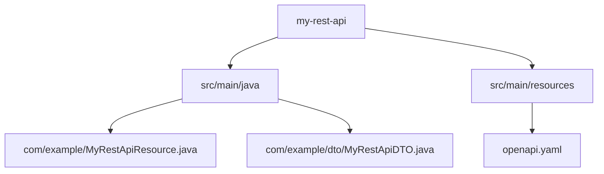

Liferay **REST Builder** is a powerful tool that simplifies the creation of **JAX-RS-based REST APIs** in Liferay DXP/Portal. It generates **DTOs (Data Transfer Objects)**, **Resource classes**, and **OpenAPI documentation** automatically, reducing boilerplate code.

This guide covers:

1. **Setting up REST Builder with Blade CLI**
2. **Generating REST Modules**
3. **Customizing Generated APIs**
4. **Building & Deploying**
5. **Testing REST APIs**

---

## 1. Setting Up REST Builder

### Prerequisites

- Liferay DXP/Portal 7.4+
- **Liferay Workspace** (with Blade CLI installed)
- **Java 11+**

### Install Blade CLI

<a href="https://help.liferay.com/hc/en-us/articles/360017885232-Installing-Blade-CLI" target="_blank">Installing Blade CLI</a>

### Verify Installation

```bash
blade version
```

---

## 2. Creating a REST Module

### Step 1: Generate a REST Module

Use Blade CLI to scaffold a REST module:

```bash
blade create -t rest-builder -p com.example -c MyRestApi my-rest-api
```

This creates:

- A **JAX-RS resource** (`MyRestApiResource`)
- A **DTO** (`MyRestApiDTO`)
- **OpenAPI YAML** (`openapi.yaml`)

### Project Structure



---

## 3. Customizing the REST API

### Modify `openapi.yaml`

Define your API schema:

```yaml
openapi: 3.0.1
info:
  title: My REST API
  version: v1.0
paths:
  /my-rest-api:
    get:
      responses:
        "200":
          description: OK
          content:
            application/json:
              schema:
                $ref: "#/components/schemas/MyRestApiDTO"
components:
  schemas:
    MyRestApiDTO:
      type: object
      properties:
        id:
          type: string
        name:
          type: string
```

### **Update `MyRestApiResource.java`**

```java
@Path("/v1.0/my-rest-api")
@Produces("application/json")
@Consumes("application/json")
public class MyRestApiResource {

    @GET
    public MyRestApiDTO getMyRestApi() {
        return new MyRestApiDTO("1", "Example REST API");
    }

    @POST
    public MyRestApiDTO createMyRestApi(MyRestApiDTO myRestApiDTO) {
        return myRestApiDTO;
    }
}
```

### DTO (`MyRestApiDTO.java`)

```java
public class MyRestApiDTO {
    private String id;
    private String name;

    // Getters & Setters
    // Constructor
}
```

---

## 4. Building & Deploying

### Build with Gradle

```bash
cd my-rest-api
./gradlew build
```

### Deploy to Liferay

```bash
blade deploy
```

### Verify Deployment

Check in **Liferay Control Panel → Gogo Shell**:

```bash
lb | grep my-rest-api
```

---

## 5. Testing the REST API

### Using cURL

```bash
curl -X GET "http://localhost:8080/o/api/my-rest-api/v1.0/my-rest-api" -u test@liferay.com:test
```

### Using Postman

1. **GET Request**:  
   `http://localhost:8080/o/api/my-rest-api/v1.0/my-rest-api`  
   (Use **Basic Auth** with Liferay credentials)

2. **POST Request**:
   ```json
   {
     "id": "2",
     "name": "New REST API"
   }
   ```

---

## 6. Advanced Customizations

### Adding Pagination

```java
@GET
public Page<MyRestApiDTO> getMyRestApiPage(
    @Context Pagination pagination,
    @Context Sort[] sorts
) {
    // Fetch data with pagination
    return Page.of(items, pagination, totalCount);
}
```

### Adding Permission Checks

```java
@GET
public MyRestApiDTO getMyRestApi(@Context User user) {
    if (!PermissionChecker.contains(user.getRoles(), "VIEW")) {
        throw new ForbiddenException();
    }
    return new MyRestApiDTO("1", "Example REST API");
}
```

---

## 7. OpenAPI (Swagger) Documentation

REST Builder auto-generates OpenAPI docs:

- Access at:  
  `http://localhost:8080/o/api?endpoint=http://localhost:8080/o/my-rest-api`

### Customizing OpenAPI

Modify `openapi.yaml`:

```yaml
paths:
  /my-rest-api:
    get:
      summary: "Get My REST API"
      description: "Returns a sample REST API response"
```

---

## 8. Troubleshooting

| Issue                   | Solution                                         |
| ----------------------- | ------------------------------------------------ |
| **404 Not Found**       | Check if module is deployed (`lb` in Gogo Shell) |
| **403 Forbidden**       | Ensure proper permissions in `resource-actions`  |
| **DTO not serializing** | Ensure `@JsonSerialize` annotations are used     |

---

## Conclusion

Liferay **REST Builder** accelerates REST API development by:
✅ **Generating boilerplate code**  
✅ **Supporting OpenAPI docs**  
✅ **Integrating with Liferay security**

Use **Blade CLI** for quick scaffolding and **Gradle** for building.

### **Next Steps**

- Learn **Liferay Headless APIs**
- Check **Liferay REST Builder docs**:
