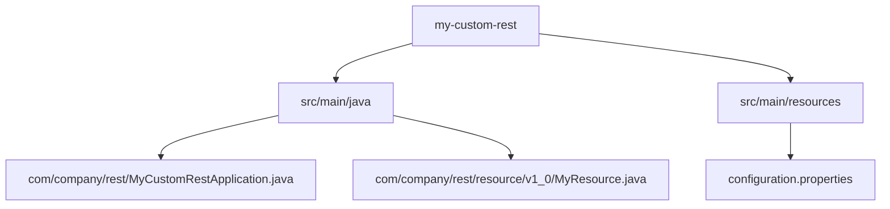

This guide focuses on **manually creating Liferay REST modules** (without REST Builder) for full control over JAX-RS implementation. We'll cover module creation, endpoint development, security, and testing.

## 1. Setting Up a REST Module

### Prerequisites

- Liferay DXP/Portal 7.4+
- **Liferay Workspace** (with Blade CLI installed)
- **Java 11+**

### Install Blade CLI

<a href="https://help.liferay.com/hc/en-us/articles/360017885232-Installing-Blade-CLI" target="_blank">Installing Blade CLI</a>

### Verify Installation

```bash
blade version
```

### Create Module Using Blade CLI

```bash
blade create -t rest -p com.company.rest -c MyCustomRest my-custom-rest
```

### Project Structure



## 2. Core Components

### 1. JAX-RS Application Class

```java
@Component(
    immediate = true,
    property = {
        "jaxrs.application=true",
        "auth.verifier.guest.allowed=true"
    },
    service = Application.class
)
public class MyCustomRestApplication extends Application {

    @Override
    public Set<Object> getSingletons() {
        return Collections.singleton(this);
    }

    @Override
    public Set<Class<?>> getClasses() {
        Set<Class<?>> classes = new HashSet<>();
        classes.add(MyResource.class);
        return classes;
    }
}
```

### 2. Resource Class (Endpoint)

```java
@Path("/my-api/v1.0")
@Produces(MediaType.APPLICATION_JSON)
@Consumes(MediaType.APPLICATION_JSON)
public class MyResource {

    @GET
    @Path("/items/{id}")
    public Response getItem(@PathParam("id") long id) {
        return Response.ok(
            Map.of("id", id, "name", "Item " + id)
        ).build();
    }

    @POST
    @Path("/items")
    public Response createItem(ItemDTO itemDTO) {
        return Response.status(Response.Status.CREATED)
            .entity(itemDTO)
            .build();
    }
}
```

### 3. DTO Class

```java
public class ItemDTO implements Serializable {

    private long id;
    private String name;
    private String description;

    // Getters & Setters
    // toString(), equals(), hashCode()
}
```

## 3. Advanced Features

### Pagination & Sorting

```java
@GET
@Path("/items")
public Page<ItemDTO> getItems(
    @Context Pagination pagination,
    @Context Sort[] sorts
) {
    List<ItemDTO> items = fetchItems(pagination, sorts);
    return Page.of(items, pagination, items.size());
}
```

### Permission Checking

```java
@DELETE
@Path("/items/{id}")
public Response deleteItem(
    @PathParam("id") long id,
    @Context PermissionChecker permissionChecker
) {
    if (!permissionChecker.hasPermission(
        "DELETE_ITEM")) {
        throw new ForbiddenException();
    }
    deleteItem(id);
    return Response.noContent().build();
}
```

### Exception Handling

```java
@Provider
public class CustomExceptionMapper
    implements ExceptionMapper<Exception> {

    @Override
    public Response toResponse(Exception e) {
        return Response.status(500)
            .entity(Map.of(
                "error", e.getMessage(),
                "code", 500
            ))
            .build();
    }
}
```

## 4. Build & Deploy

### Gradle Build (build.gradle)

```gradle
dependencies {
    compileOnly group: "com.liferay.portal", name: "release.portal.api"
    compileOnly group: "javax.ws.rs", name: "javax.ws.rs-api"
    compileOnly group: "org.osgi", name: "org.osgi.service.component.annotations"
}
```

### Build Command

```bash
./gradlew build
```

### Deploy Command

```bash
blade deploy
```

## 5. Testing REST Endpoints

### cURL Examples

```bash
# GET Request
curl -X GET "http://localhost:8080/o/my-api/v1.0/items/123" \
  -u test@liferay.com:test

# POST Request
curl -X POST "http://localhost:8080/o/my-api/v1.0/items" \
  -H "Content-Type: application/json" \
  -d '{"name":"New Item","description":"Test"}' \
  -u test@liferay.com:test
```

### Postman Collection

```json
{
  "info": {
    "name": "My Custom REST API",
    "schema": "https://schema.getpostman.com/json/collection/v2.1.0/collection.json"
  },
  "item": [
    {
      "name": "Get Item",
      "request": {
        "method": "GET",
        "header": [
          {
            "key": "Authorization",
            "value": "Basic {{base64Credentials}}"
          }
        ],
        "url": {
          "raw": "http://localhost:8080/o/my-api/v1.0/items/123"
        }
      }
    }
  ]
}
```

## 6. Best Practices

1. **Versioning**: Always include version in path (`/v1.0/`)
2. **Security**: Use `@Context PermissionChecker` for auth
3. **Documentation**: Add OpenAPI annotations
4. **Error Handling**: Custom exception mappers
5. **Pagination**: Support `Pagination` and `Sort`

## 7. Troubleshooting

| Issue              | Solution                                     |
| ------------------ | -------------------------------------------- |
| 404 Not Found      | Check module deployment (`lb` in Gogo shell) |
| 403 Forbidden      | Verify permissions in `resource-actions`     |
| JSON Parsing Error | Ensure proper DTO serialization              |

## Conclusion

This manual REST module approach gives you:
✅ Full control over JAX-RS implementation  
✅ Direct Liferay service integration  
✅ Flexible security configuration  
✅ Custom exception handling

For rapid development, consider **Liferay REST Builder**, but for complex scenarios, **manual REST modules** provide the most flexibility.

🚀 **Next Steps**:

- Learn about Headless Delivery APIs
- Check Liferay's official REST documentation
