Liferay REST modules are OSGi-based components that allow developers to create custom RESTful endpoints within the Liferay platform. These modules follow JAX-RS standards while integrating seamlessly with Liferay's security and dependency injection systems.

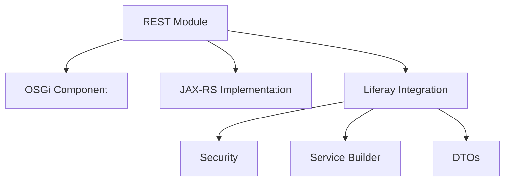

## Types of REST Modules in Liferay

### 1. Basic Resource Modules

The simplest form of REST modules that expose standard CRUD operations.

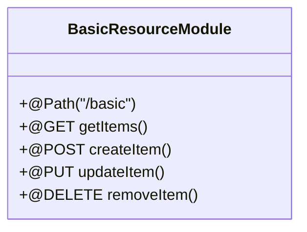

### 2. Headless Delivery Modules

Extensions of Liferay's headless delivery system for custom content types.

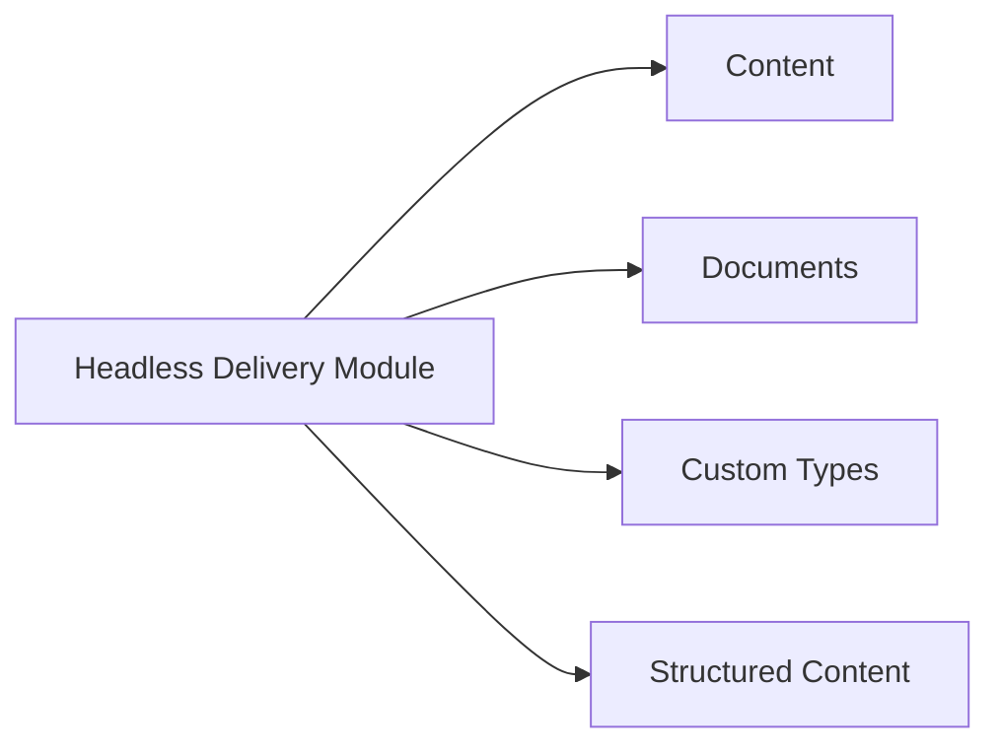

### 3. Admin REST Modules

For administrative operations that require elevated permissions.

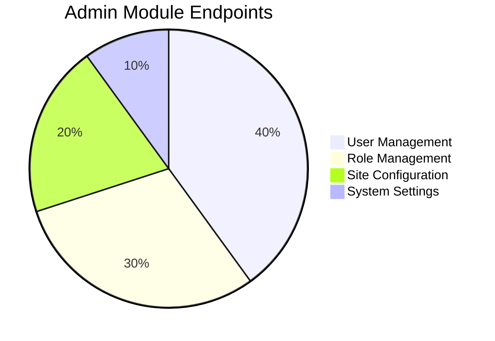

### 4. Composite Resource Modules

Modules that aggregate multiple resources or services into single endpoints.

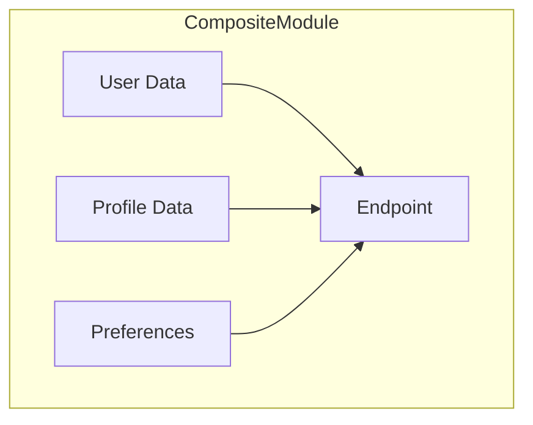

### 5. Proxy REST Modules

Modules that act as intermediaries between Liferay and external systems.

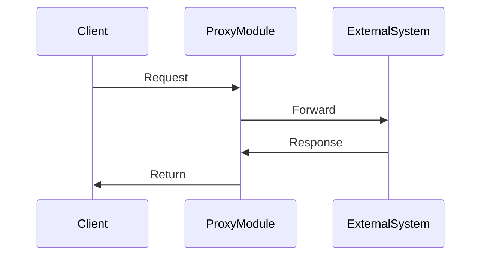

## REST Module Structure

### Core Components

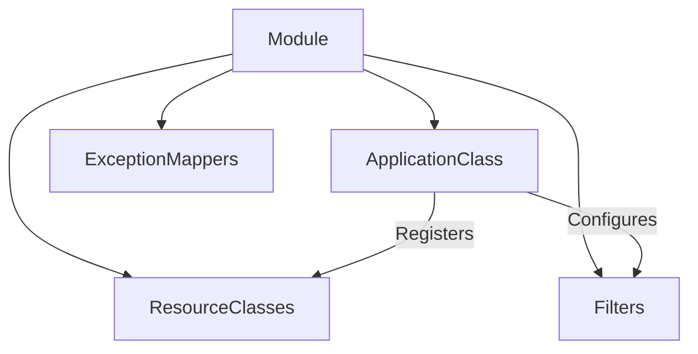

### Annotations Overview

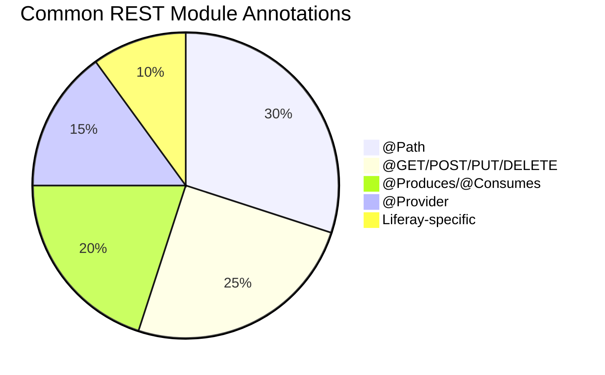

## REST Module Implementation Patterns

### 1. Resource-Oriented Pattern

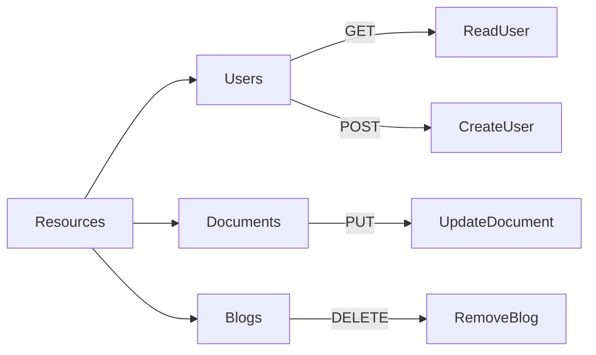

### 2. Controller Pattern

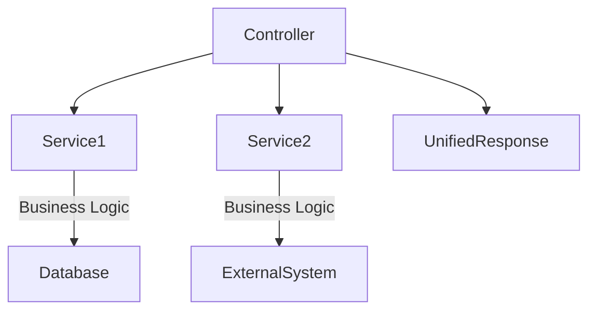

### 3. Microservice Gateway Pattern

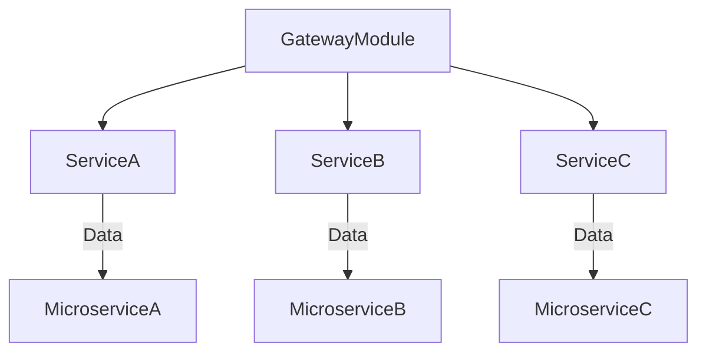

## Key Characteristics of Liferay REST Modules

1. **OSGi-based**: Deployed as modular components
2. **JAX-RS Compliant**: Standard implementation
3. **Liferay Integrated**: Security, DTOs, exceptions
4. **Versionable**: Support for API versioning
5. **Documentable**: OpenAPI/Swagger support

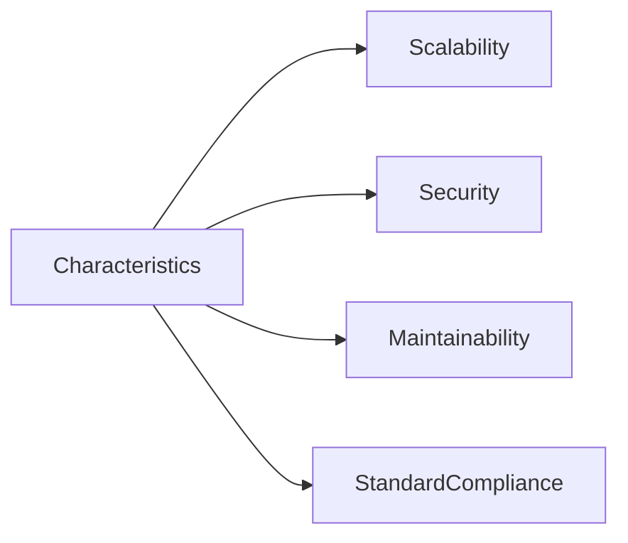
