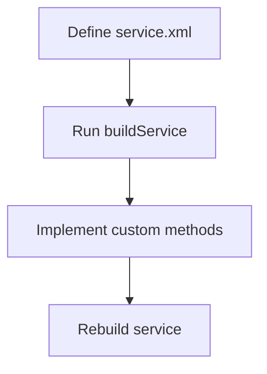
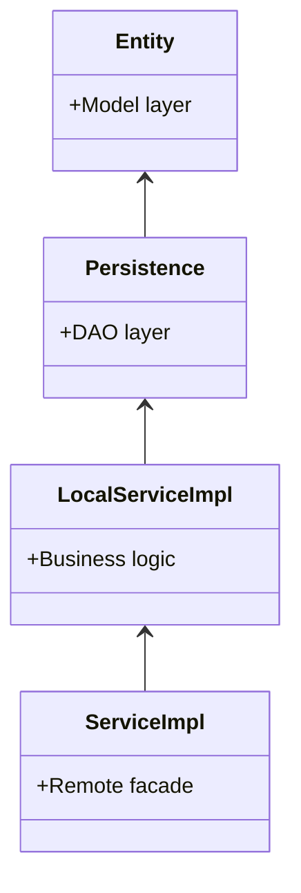
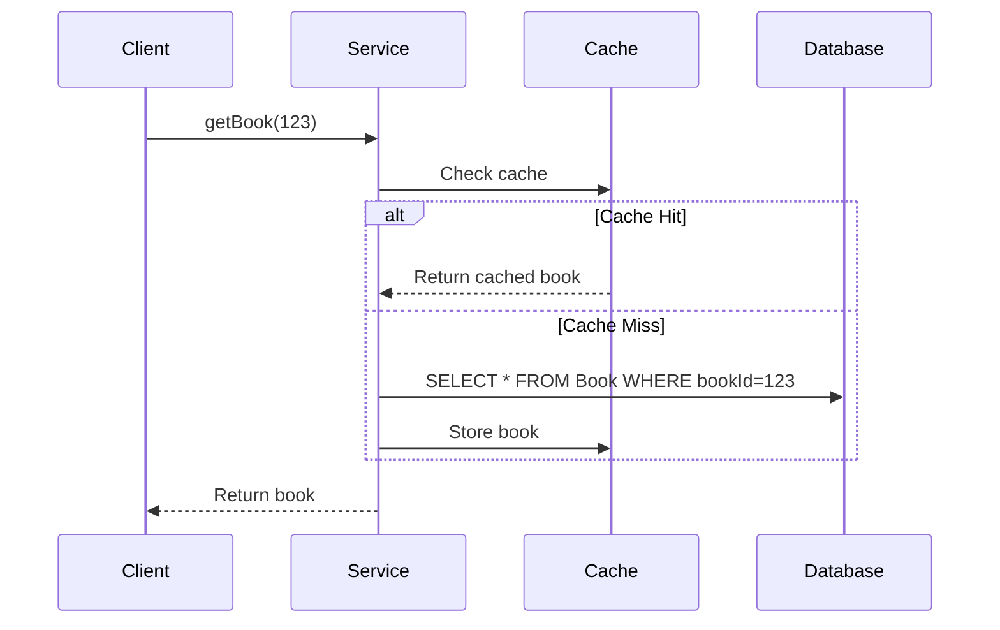

Liferay Service Builder is a powerful code generation tool that automates the creation of service and persistence layers for custom entities. It streamlines development by generating boilerplate code, enforcing best practices, and integrating seamlessly with Liferay’s permission and transaction systems. This approach ensures consistency, scalability, and maintainability for enterprise applications.

## Service Builder Fundamentals

### Why Service Builder?

- **Rapid Development**: Generates 80% of boilerplate code
- **Consistency**: Standardized service structure
- **Optimized**: Built-in caching and transaction management
- **Integrated**: Works seamlessly with Liferay's permission system

### Basic Workflow



## Core Architectural Patterns

### 1. Layered Architecture Pattern



**Best Practice**:

- Keep business logic in `*LocalServiceImpl`
- Use `*ServiceImpl` only as remote facade
- Never modify generated classes

### 2. Bridge Pattern for Custom SQL

```xml
<!-- service.xml -->
<entity name="Employee" ...>
    <!-- ... -->
    <finder name="Department" return-type="Collection">
        <finder-column name="departmentId" />
    </finder>
</entity>
```

```java
// EmployeeFinderImpl.java
public class EmployeeFinderImpl extends EmployeeFinderBaseImpl {
    public List<Employee> findByDepartment(long departmentId, int start, int end) {
        // Custom SQL implementation
    }
}
```

## Data Modeling Patterns

### 1. Entity Design Patterns

**Basic Entity**:

```xml
<entity name="Book" local-service="true" remote-service="true">
    <column name="bookId" type="long" primary="true" />
    <column name="title" type="String" />
    <column name="author" type="String" />
</entity>
```

**Advanced Patterns**:

- **TypeSettings Pattern**: Store flexible attributes as JSON

```xml
<column name="typeSettings" type="String" />
```

- **Audit Trail Pattern**:

```xml
<column name="createDate" type="Date" />
<column name="modifiedDate" type="Date" />
<column name="userId" type="long" />
```

### 2. Relationship Patterns

**One-to-Many**:

```xml
<entity name="Department" ...>
    <!-- ... -->
</entity>

<entity name="Employee" ...>
    <column name="departmentId" type="long" />
    <finder name="Department" return-type="Collection">
        <finder-column name="departmentId" />
    </finder>
</entity>
```

**Many-to-Many**:

```xml
<entity name="Student" ...>
    <!-- ... -->
</entity>

<entity name="Course" ...>
    <!-- ... -->
</entity>

<entity name="StudentCourse" local-service="true">
    <column name="studentCourseId" type="long" primary="true" />
    <column name="studentId" type="long" />
    <column name="courseId" type="long" />
    <finder name="Student" return-type="Collection">
        <finder-column name="studentId" />
    </finder>
    <finder name="Course" return-type="Collection">
        <finder-column name="courseId" />
    </finder>
</entity>
```

## Service Layer Patterns

### 1. Facade Pattern

**Local Service** (`BookLocalServiceImpl`):

```java
public Book addBook(long userId, String title, String author) {
    // Validation
    validate(title, author);

    // Create entity
    long bookId = counterLocalService.increment();
    Book book = bookPersistence.create(bookId);
    book.setTitle(title);
    book.setAuthor(author);

    // Audit fields
    book.setUserId(userId);
    book.setCreateDate(new Date());

    return bookPersistence.update(book);
}
```

**Remote Service** (`BookServiceImpl`):

```java
public Book addBook(long userId, String title, String author) {
    return bookLocalService.addBook(userId, title, author);
}
```

### 2. Strategy Pattern for Business Logic

```java
public interface DiscountCalculator {
    BigDecimal calculateDiscount(Order order);
}

@Component(service = DiscountCalculator.class)
public class HolidayDiscountCalculator implements DiscountCalculator {
    // Implementation
}

public class OrderLocalServiceImpl extends OrderLocalServiceBaseImpl {

    @Reference(policyOption = ReferencePolicyOption.GREEDY)
    private volatile List<DiscountCalculator> _discountCalculators;

    public BigDecimal calculateTotal(Order order) {
        BigDecimal total = order.getBaseAmount();

        for (DiscountCalculator calculator : _discountCalculators) {
            total = total.subtract(calculator.calculateDiscount(order));
        }

        return total;
    }
}
```

## Performance Optimization

### 1. Caching Patterns

**Entity Cache** (enabled by default):



**Finder Cache**:

```xml
<finder name="Author" return-type="Collection" db-index="false">
    <finder-column name="author" />
</finder>
```

### 2. Batch Processing Pattern

```java
public void updateAllBooks(LambdaFunction<Book, Book> updateFunction) {
    DynamicQuery query = DynamicQueryFactoryUtil.forClass(Book.class);

    try (BatchSession batchSession = persistence.openBatchSession()) {
        List<Book> books = bookPersistence.findWithDynamicQuery(query);

        for (Book book : books) {
            Book updatedBook = updateFunction.apply(book);
            bookPersistence.update(book, batchSession);
        }

        batchSession.flush();
    }
}
```

## Integration Patterns

### 1. Adapter Pattern for External Systems

```java
@Component(service = InventoryService.class)
public class InventoryServiceAdapter implements InventoryService {

    @Reference
    private BookLocalService _bookLocalService;

    @Reference
    private ExternalInventorySystem _externalSystem;

    public boolean checkStock(long bookId, int quantity) {
        Book book = _bookLocalService.getBook(bookId);
        return _externalSystem.checkAvailability(book.getISBN(), quantity);
    }
}
```

### 2. Event Bus Pattern

```java
public class OrderLocalServiceImpl extends OrderLocalServiceBaseImpl {

    public Order completeOrder(long orderId) {
        Order order = orderPersistence.findByPrimaryKey(orderId);
        order.setStatus("COMPLETED");
        orderPersistence.update(order);

        // Send event
        MessageBus messageBus = MessageBusUtil.getMessageBus();
        messageBus.sendMessage(
            "liferay/order_events",
            MessageCreator.createMessage(order));

        return order;
    }
}
```

## Testing Strategies

### 1. Unit Testing Pattern

```java
public class BookLocalServiceImplTest {

    @Mock
    private BookPersistence _bookPersistence;

    @InjectMocks
    private BookLocalServiceImpl _service;

    @Test
    public void testAddBook() {
        when(_bookPersistence.create(anyLong())).thenReturn(new BookImpl());

        Book book = _service.addBook(1, "Title", "Author");

        assertNotNull(book);
        assertEquals("Title", book.getTitle());
    }
}
```

### 2. Integration Testing Pattern

```java
@RunWith(Arquillian.class)
public class BookServiceIntegrationTest {

    @Inject
    private BookLocalService _bookLocalService;

    @Test
    public void testAddBook() {
        Book book = _bookLocalService.addBook(
            TestPropsValues.getUserId(),
            "Test Book",
            "Test Author");

        assertNotNull(book.getBookId());
    }
}
```

## Migration Patterns

### 1. Versioning Pattern

```xml
<entity name="Book" ...>
    <column name="version" type="double" />
</entity>
```

```java
public Book updateBook(long bookId, String title) {
    Book book = bookPersistence.findByPrimaryKey(bookId);
    book.setTitle(title);
    book.setVersion(book.getVersion() + 1);
    return bookPersistence.update(book);
}
```

### 2. Blue-Green Deployment Pattern

1. Create parallel tables (`Book_v2`)
2. Implement dual-write in service layer
3. Migrate data gradually
4. Switch read operations to new table
5. Remove old table

## Key Benefits of Service Builder

1. **Rapid Development**:

   - Generates 90% of persistence code
   - Standardized service structure
   - Built-in best practices

2. **Optimized Performance**:

   - Automatic caching
   - Batch processing support
   - Optimized SQL generation

3. **Liferay Integration**:

   - Built-in permission checking
   - Audit fields support
   - Seamless upgrade process

4. **Maintainability**:
   - Clear separation of concerns
   - Generated code is consistent
   - Easy to refactor

Service Builder provides an excellent balance between productivity and flexibility, making it ideal for most Liferay development scenarios while still allowing custom patterns when needed.
