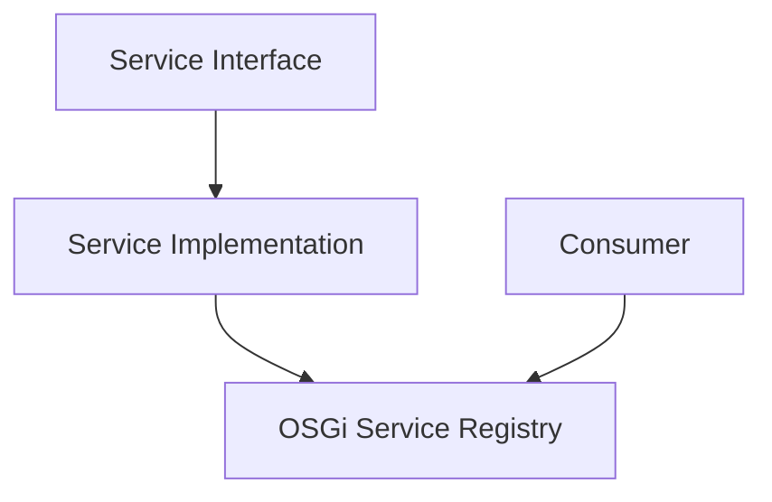
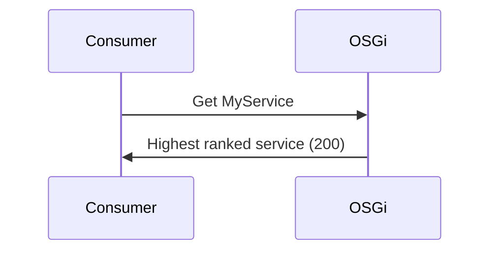

A Liferay `service` module is an **OSGi-based component** that `encapsulates` `reusable business logic` and exposes it as services within the platform. It enables modular development, dynamic service registration, and loose coupling between application features. This approach improves maintainability, scalability, and flexibility for enterprise solutions

### OSGi Service Fundamentals

Liferay uses OSGi (Open Service Gateway Initiative) as its module system:

- Services are Java interfaces + implementations
- Components declare services they provide/consume
- Dynamic lifecycle management



### Key Annotations

| Annotation   | Purpose                               |
| ------------ | ------------------------------------- |
| `@Component` | Declares an OSGi component            |
| `@Reference` | Declares service dependency           |
| `@Service`   | Alternative to `@Component(service=)` |

## Core Service Types

### 1. Basic Service

```java
public interface GreeterService {
    String greet(String name);
}

@Component(service = GreeterService.class)
public class GreeterServiceImpl implements GreeterService {
    @Override
    public String greet(String name) {
        return "Hello " + name;
    }
}
```

### 2. Managed Service

```java
@Component(
    configurationPid = "com.example.MyConfig",
    service = ConfigurableService.class
)
public class ConfigurableServiceImpl implements ConfigurableService {

    @Activate
    protected void activate(Map<String, Object> properties) {
        // Process configuration
    }

    @Modified
    protected void modified(Map<String, Object> properties) {
        // Handle config changes
    }
}
```

### 3. Factory Service

```java
@Component(service = ConnectionFactory.class)
public class ConnectionFactoryImpl implements ConnectionFactory {

    @Reference
    private ComponentServiceObjects<Connection> _connectionServiceObjects;

    public Connection createConnection() {
        return _connectionServiceObjects.getService();
    }

    public void releaseConnection(Connection connection) {
        _connectionServiceObjects.ungetService(connection);
    }
}
```

## Service Registration Patterns

### 1. Multiple Interfaces

```java
@Component(
    service = {ServiceA.class, ServiceB.class}
)
public class CombinedServiceImpl implements ServiceA, ServiceB {
    // Implements both interfaces
}
```

### 2. Service Properties

```java
@Component(
    property = {
        "service.ranking:Integer=100",
        "custom.property=true"
    },
    service = MyService.class
)
public class PrioritizedServiceImpl implements MyService {
    // Higher priority implementation
}
```

### 3. Service Ranking



## Dependency Injection Patterns

### 1. Static vs Dynamic

```java
// Static (mandatory) reference
@Reference
private MyService _myService;

// Dynamic (optional) reference
@Reference(policyOption = ReferencePolicyOption.GREEDY)
private volatile MyService _myService;
```

### 2. Multiple Implementations

```java
@Reference(
    target = "(component.name=com.example.SpecificImpl)"
)
private MyService _specificService;
```

### 3. Collection of Services

```java
@Reference
private List<Validator> _validators;
```

## Service Consumption Patterns

### 1. Direct Consumption

```java
@Component(service = Consumer.class)
public class ConsumerImpl {

    @Reference
    private GreeterService _greeterService;

    public void execute() {
        _greeterService.greet("World");
    }
}
```

### 2. Service Tracker

```java
@Component(service = DynamicConsumer.class)
public class DynamicConsumerImpl implements ServiceTrackerCustomizer<MyService, MyService> {

    private ServiceTracker<MyService, MyService> _serviceTracker;

    @Activate
    protected void activate(BundleContext bundleContext) {
        _serviceTracker = new ServiceTracker<>(
            bundleContext, MyService.class, this);
        _serviceTracker.open();
    }

    @Override
    public MyService addingService(ServiceReference<MyService> reference) {
        MyService service = bundleContext.getService(reference);
        // Handle new service
        return service;
    }
}
```

### 3. Whiteboard Pattern

```java
@Component(service = EventListener.class)
public class EventListenerImpl implements MyEventListener {
    // Automatically registered
}

@Component(service = EventDispatcher.class)
public class EventDispatcherImpl {

    @Reference
    private List<MyEventListener> _listeners;

    public void dispatch(Event event) {
        _listeners.forEach(l -> l.onEvent(event));
    }
}
```

## Advanced Service Techniques

### 1. Service Proxy

```java
@Component(service = ExpensiveService.class)
public class ExpensiveServiceProxy implements ExpensiveService {

    private volatile ExpensiveService _delegate;

    @Reference(
        target = "(proxy=false)",
        unbind = "unsetExpensiveService"
    )
    protected void setExpensiveService(ExpensiveService expensiveService) {
        _delegate = expensiveService;
    }

    @Override
    public void performOperation() {
        if (_delegate != null) {
            _delegate.performOperation();
        }
    }
}
```

### 2. Service Decorator

```java
@Component(
    property = "service.ranking:Integer=100",
    service = MyService.class
)
public class MyServiceDecorator implements MyService {

    @Reference(
        target = "(component.name=com.example.MyServiceImpl)"
    )
    private MyService _myService;

    @Override
    public void execute() {
        // Pre-processing
        _myService.execute();
        // Post-processing
    }
}
```

### 3. Service Factory

```java
@Component(service = ServiceFactory.class)
public class PrototypeServiceFactory implements ServiceFactory<PrototypeService> {

    @Override
    public PrototypeService getService(
        Bundle bundle,
        ServiceRegistration<PrototypeService> registration) {
        return new PrototypeServiceImpl();
    }

    @Override
    public void ungetService(
        Bundle bundle,
        ServiceRegistration<PrototypeService> registration,
        PrototypeService service) {
        // Cleanup
    }
}
```

## Best Practices

1. **Interface Design**:

   - Keep service interfaces focused (Single Responsibility Principle)
   - Design for extension (open/closed principle)
   - Consider versioning from the start

2. **Lifecycle Management**:

   - Clean up resources in `@Deactivate` methods
   - Use `@Activate` for initialization
   - Handle dynamic service availability

3. **Performance**:

   - Minimize synchronization in services
   - Consider lazy initialization for expensive resources
   - Use service trackers for optional dependencies

4. **Thread Safety**:
   - Assume services are called from multiple threads
   - Document thread safety guarantees
   - Use concurrent data structures

## Common Anti-Patterns

### 1. Over-Synchronization

```java
// Bad - unnecessary synchronization
@Component(service = CounterService.class)
public class CounterServiceImpl implements CounterService {
    private int count;

    public synchronized void increment() {
        count++;
    }
}

// Better - use AtomicInteger
@Component(service = CounterService.class)
public class CounterServiceImpl implements CounterService {
    private final AtomicInteger count = new AtomicInteger();

    public void increment() {
        count.incrementAndGet();
    }
}
```

### 2. Ignoring Service Dynamics

```java
// Bad - assumes service is always available
@Component(service = Consumer.class)
public class ConsumerImpl {
    @Reference
    private volatile OptionalService _optionalService;

    public void execute() {
        _optionalService.doSomething(); // NPE risk
    }
}

// Better - check availability
@Component(service = Consumer.class)
public class ConsumerImpl {
    @Reference
    private volatile OptionalService _optionalService;

    public void execute() {
        OptionalService service = _optionalService;
        if (service != null) {
            service.doSomething();
        }
    }
}
```

### 3. Tight Coupling

```java
// Bad - concrete implementation dependency
@Component(service = Consumer.class)
public class ConsumerImpl {
    @Reference
    private SpecificServiceImpl _service;
}

// Good - interface dependency
@Component(service = Consumer.class)
public class ConsumerImpl {
    @Reference
    private MyService _service;
}
```
