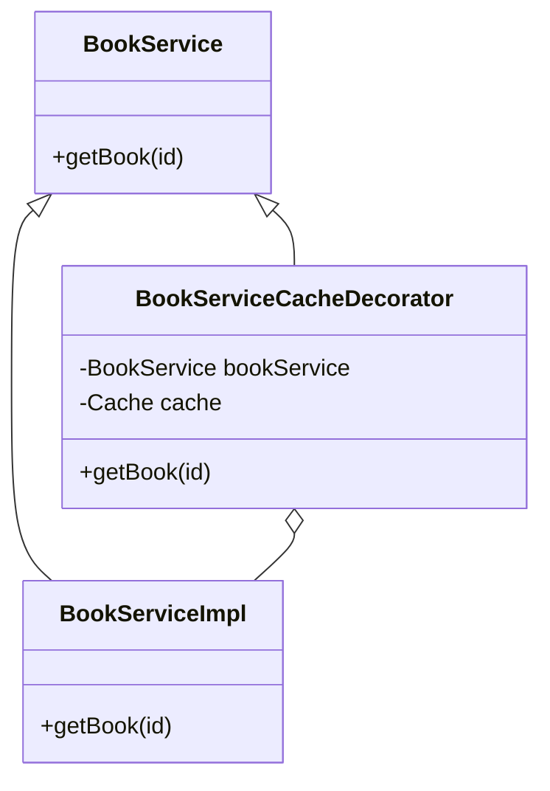
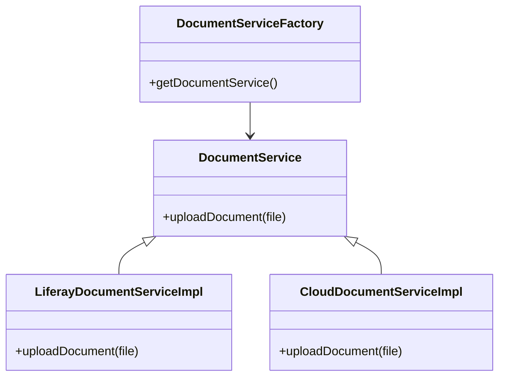
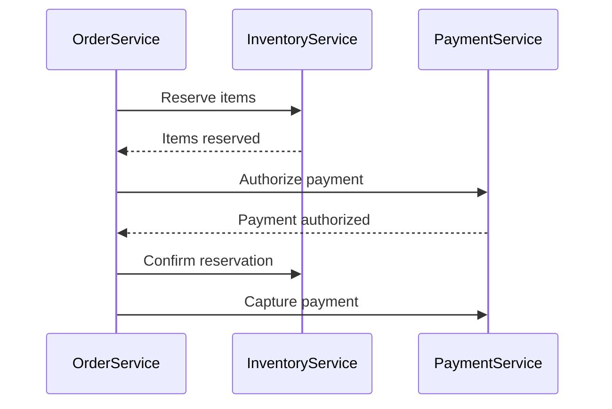

## Core Service Patterns

### 1. Gateway Pattern

**Use Case**: Centralize access to external systems or legacy code

**Implementation**:

```java
public interface ExternalSystemGateway {
    public Response submitData(DataPayload payload);
}

@Component
public class ExternalSystemGatewayImpl implements ExternalSystemGateway {
    // Implementation with retry logic, error handling, etc.
}
```

**Benefits**:

- Isolate external system dependencies
- Centralize cross-cutting concerns (logging, retries)
- Easier to mock for testing

### 2. Decorator Pattern

**Use Case**: Add functionality to existing services without modifying core implementation

**Implementation**:



```java
@Component(
    property = {
        "service.ranking:Integer=100"
    },
    service = BookService.class
)
public class BookServiceCacheDecorator implements BookService {

    @Reference(target = "(!(component.name=BookServiceCacheDecorator))")
    private BookService _bookService;

    @Override
    public Book getBook(long id) {
        // Cache implementation
    }
}
```

### 3. Strategy Pattern

**Use Case**: Alternate implementations for business rules

**Implementation**:

```java
public interface DiscountStrategy {
    public BigDecimal calculateDiscount(Order order);
}

@Component
public class HolidayDiscountStrategy implements DiscountStrategy {
    // Implementation
}

@Component
public class PricingService {

    @Reference(policyOption = ReferencePolicyOption.GREEDY)
    private volatile List<DiscountStrategy> _discountStrategies;

    public BigDecimal calculatePrice(Order order) {
        // Apply appropriate strategy
    }
}
```

## Transactional Patterns

### 1. Retry Pattern

**Use Case**: Handle transient failures in database operations

**Implementation**:

```java
public class RetryTemplate {

    public <T> T executeWithRetry(Callable<T> callable, int maxAttempts) {
        // Implementation with exponential backoff
    }
}

@Component
public class OrderServiceImpl extends OrderServiceBaseImpl {

    public void processOrder(Order order) {
        new RetryTemplate().executeWithRetry(() -> {
            // Transactional operation
            return null;
        }, 3);
    }
}
```

### 2. Compensation Pattern

**Use Case**: Handle rollbacks in distributed scenarios

**Implementation**:

```java
public interface CompensatingAction {
    void execute();
    void compensate();
}

@Component
public class OrderProcessor {

    public void process(Order order) {
        List<CompensatingAction> actions = new ArrayList<>();

        try {
            actions.add(inventoryService.reserveItems(order));
            actions.add(paymentService.authorizePayment(order));
            // Commit all actions
        } catch (Exception e) {
            // Execute compensations in reverse order
            Collections.reverse(actions);
            actions.forEach(CompensatingAction::compensate);
        }
    }
}
```

## Integration Patterns

### 1. Bridge Pattern

**Use Case**: Connect Liferay services with external systems

**Implementation**:



### 2. Event Bus Pattern

**Use Case**: Decoupled service communication

**Implementation**:

```java
@Component
public class OrderEventListener implements MessageListener {

    @Override
    public void receive(Message message) {
        // Process order event
    }
}

@Component
public class OrderServiceImpl extends OrderServiceBaseImpl {

    public void completeOrder(Order order) {
        // Business logic

        MessageBus messageBus = MessageBusUtil.getMessageBus();
        messageBus.sendMessage(
            "liferay/order_events",
            new MessageCreator() {
                // Create message
            }
        );
    }
}
```

## Advanced Patterns

### 1. CQRS Pattern

**Use Case**: Separate read and write operations for complex domains

**Implementation**:

```java
// Command side
@Component
public class OrderCommandServiceImpl extends OrderCommandServiceBaseImpl {
    public void placeOrder(Order order) {
        // Validation and business logic
        orderPersistence.update(order);

        // Send to query side through event
    }
}

// Query side
@Component
public class OrderQueryServiceImpl implements OrderQueryService {

    private final Map<Long, OrderDTO> orderCache = new ConcurrentHashMap<>();

    @Reference
    private OrderLocalService _orderLocalService;

    public OrderDTO getOrder(long orderId) {
        return orderCache.computeIfAbsent(orderId, id -> {
            Order order = _orderLocalService.getOrder(id);
            return convertToDTO(order);
        });
    }
}
```

### 2. Saga Pattern

**Use Case**: Manage long-running business transactions

**Implementation**:



```java
@Component
public class OrderSaga {

    @Reference
    private InventoryService _inventoryService;

    @Reference
    private PaymentService _paymentService;

    public void execute(Order order) {
        SagaExecution saga = new SagaExecution();

        saga.addStep(
            () -> _inventoryService.reserveItems(order),
            () -> _inventoryService.cancelReservation(order)
        );

        saga.addStep(
            () -> _paymentService.authorizePayment(order),
            () -> _paymentService.cancelAuthorization(order)
        );

        try {
            saga.execute();
        } catch (SagaException e) {
            saga.compensate();
        }
    }
}
```

## Best Practices for Service Patterns

1. **Pattern Selection Criteria**:

   - Match pattern complexity to problem complexity
   - Consider Liferay's built-in capabilities before custom implementations
   - Evaluate performance implications

2. **OSGi Integration**:

   - Use declarative services for dependency management
   - Leverage service ranking for decorators
   - Consider service availability in distributed patterns

3. **Performance Considerations**:

   - Cache judiciously in decorators
   - Batch operations in complex patterns
   - Monitor saga timeouts

4. **Testing Strategies**:
   - Mock external dependencies in unit tests
   - Test compensation logic thoroughly
   - Verify transactional boundaries

These patterns provide robust solutions to common challenges in Liferay service development while maintaining alignment with the platform's architecture and capabilities.
