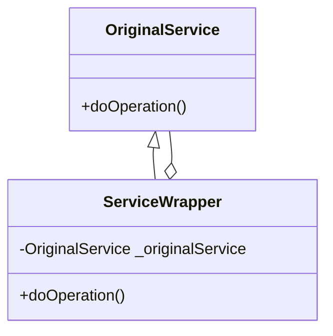
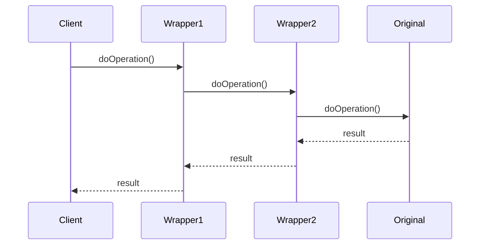

A Service Wrapper module in Liferay is an OSGi component that **extends or modifies the behavior of existing services** without changing their original implementation. It follows the Decorator Pattern to "wrap" around core services, intercepting calls to add new functionality.

## Key Characteristics

1. **Non-Invasive Extension**:

   - Doesn't require modifying original service code
   - Works with both Liferay core services and custom services
   - Maintains original service contract

2. **Interception Points**:

   - Pre-processing before service execution
   - Post-processing after service execution
   - Conditional bypass of original logic

3. **OSGi Dynamics**:
   - Managed through Declarative Services (DS)
   - Service ranking determines wrapper order
   - Can be hot-deployed/updated

## Developer Use Cases

### 1. Cross-Cutting Concerns

```java
@Component(
    service = UserLocalService.class,
    property = "service.ranking:Integer=100"
)
public class AuditUserLocalServiceWrapper extends UserLocalServiceWrapper {

    @Reference(target = "(component.name=com.liferay.portal.kernel.service.UserLocalService)")
    private UserLocalService _userLocalService;

    public AuditUserLocalServiceWrapper() {
        super(null);
    }

    @Override
    public User addUser(...) throws PortalException {
        // Pre-processing
        log("Attempting to add user: " + screenName);

        User user = super.addUser(...);

        // Post-processing
        log("User created with ID: " + user.getUserId());
        return user;
    }
}
```

**Why**: Add logging, auditing, or security checks without touching core service

### 2. Business Rule Overrides

```java
@Component(
    service = JournalArticleLocalService.class,
    property = "service.ranking:Integer=200"
)
public class CustomValidationJournalWrapper extends JournalArticleLocalServiceWrapper {

    @Override
    public JournalArticle addArticle(...) throws PortalException {
        if (containsInvalidContent(content)) {
            throw new InvalidContentException(...);
        }
        return super.addArticle(...);
    }
}
```

**Why**: Enforce custom validation rules

### 3. Feature Toggles

```java
@Component(
    service = DLAppLocalService.class,
    property = "service.ranking:Integer=300"
)
public class FeatureFlagDLAppWrapper extends DLAppLocalServiceWrapper {

    @Reference
    private FeatureFlagManager _featureFlagManager;

    @Override
    public FileEntry addFileEntry(...) throws PortalException {
        if (_featureFlagManager.isEnabled("CUSTOM_FILE_VALIDATION")) {
            validateFile(file, mimeType);
        }
        return super.addFileEntry(...);
    }
}
```

**Why**: Enable/disable features without code changes

## Implementation Patterns

### 1. Basic Wrapper Structure



### 2. Chained Wrappers



### 3. Conditional Delegation

```java
@Override
public void importantOperation() {
    if (shouldUseCustomLogic()) {
        customImplementation();
    } else {
        super.importantOperation();
    }
}
```

## Best Practices

1. **Service Ranking**:

   - Use `service.ranking` property to control order
   - Higher numbers execute first
   - Default ranking is 0

2. **Proper Targeting**:

   ```java
   @Reference(
       target = "(component.name=com.liferay.portal.kernel.service.UserLocalService)"
   )
   private UserLocalService _userLocalService;
   ```

3. **Minimal Overrides**:

   - Only override methods you need to modify
   - Call `super.method()` for default behavior
   - Document why each override exists

4. **Thread Safety**:
   - Assume services are called concurrently
   - Use thread-safe collections
   - Avoid mutable instance variables

## Common Pitfalls

1. **Infinite Recursion**:

   ```java
   // Wrong - creates stack overflow
   @Override
   public void doSomething() {
       doSomething(); // Should call super.doSomething()
   }
   ```

2. **Incorrect Service Ranking**:

   - Unordered wrappers causing unpredictable behavior
   - Not considering existing wrapper chains

3. **Over-Wrapping**:

   - Too many wrappers impacting performance
   - Complex debugging due to deep call stacks

4. **Missing super() Calls**:
   ```java
   // Wrong - breaks the chain
   @Override
   public User getUser(long id) {
       return new User(); // Should call super.getUser(id)
   }
   ```

## Advanced Techniques

### 1. Dynamic Proxy Wrappers

```java
@Service
public class DynamicWrapperFactory {

    public <T> T createWrapper(
        Class<T> serviceClass,
        T delegate,
        InvocationHandler handler) {

        return serviceClass.cast(Proxy.newProxyInstance(
            serviceClass.getClassLoader(),
            new Class<?>[] {serviceClass},
            (proxy, method, args) -> {
                // Pre-processing
                Object result = handler.invoke(delegate, method, args);
                // Post-processing
                return result;
            }));
    }
}
```

### 2. Whiteboard Pattern

```java
@Component(service = ServiceWrapperRegistrar.class)
public class ServiceWrapperRegistrar {

    @Reference
    private BundleContext _bundleContext;

    private ServiceRegistration<?> _registration;

    @Activate
    protected void activate() {
        Dictionary<String, Object> props = new Hashtable<>();
        props.put("service.ranking", 1000);

        _registration = _bundleContext.registerService(
            UserLocalService.class.getName(),
            new CustomUserLocalServiceWrapper(),
            props);
    }
}
```

### 3. AOP-Style Wrapping

```java
@Component(service = ServiceWrapper.class)
@Aspect
public class TransactionAspectWrapper {

    @Around("execution(* com.liferay..*Service.*(..))")
    public Object wrapWithTransaction(ProceedingJoinPoint joinPoint) {
        try {
            // Begin transaction
            return joinPoint.proceed();
            // Commit transaction
        } catch (Exception e) {
            // Rollback transaction
            throw e;
        }
    }
}
```

## Debugging Wrappers

1. **Inspect Wrapper Chain**:

   ```bash
   gogo:lb | grep Wrapper
   ```

2. **Logging Approach**:

   ```java
   @Override
   public void wrappedMethod() {
       log.debug("Entering wrapper");
       try {
           super.wrappedMethod();
       } finally {
           log.debug("Exiting wrapper");
       }
   }
   ```

3. **Breakpoint Strategy**:
   - Set breakpoints in both wrapper and original service
   - Examine call stack to understand wrapper order

Service Wrappers provide a powerful mechanism to extend Liferay's behavior while maintaining upgrade safety and modular design. They're particularly valuable for:

- Adding enterprise-specific logic
- Implementing cross-cutting concerns
- Customizing behavior for specific customers
- Feature toggling and A/B testing

The key is to use them judiciously - while they're powerful, overuse can lead to complex maintenance challenges.
